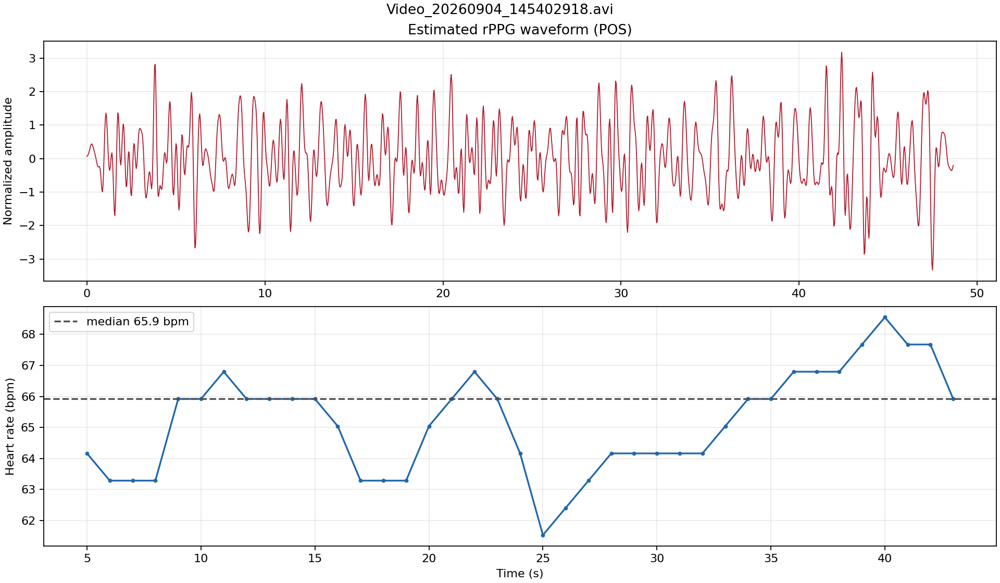
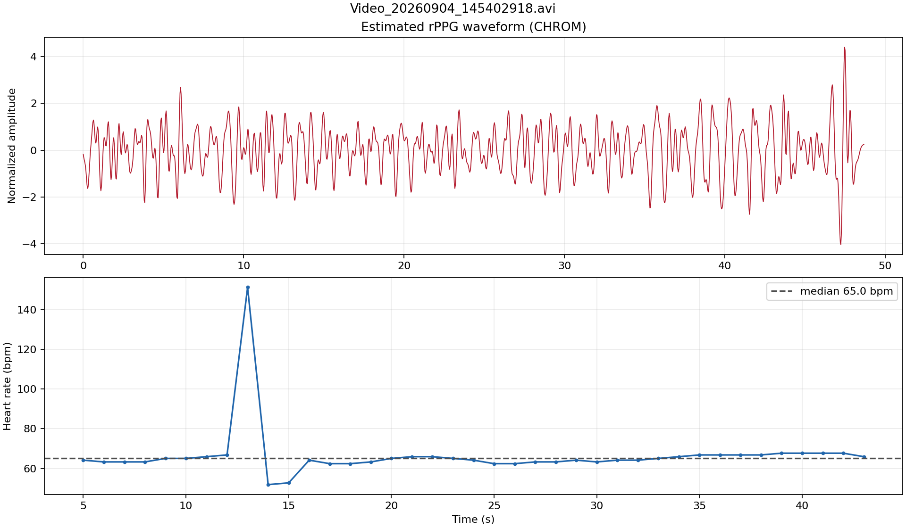
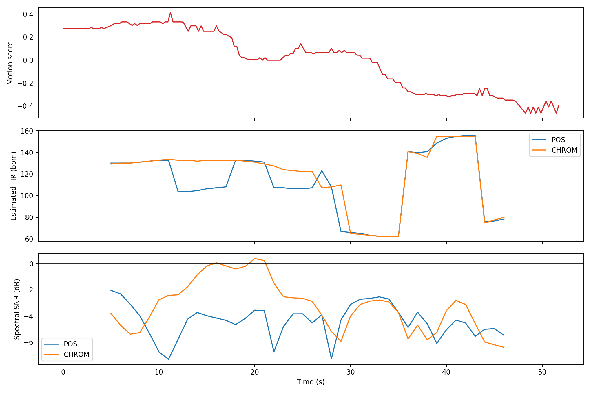

# rPPG 论文汇报与项目借鉴

## 一、论文

**Boccignone, G., Conte, D., Cuculo, V., D'Amelio, A., Grossi, G., Lanzarotti, R., & Mortara, E. (2022). _pyVHR: a Python framework for remote photoplethysmography_. PeerJ Computer Science, 8, e929.**

- 论文全文：[PeerJ / PubMed Central](https://pmc.ncbi.nlm.nih.gov/articles/PMC9044207/)
- DOI：[10.7717/peerj-cs.929](https://doi.org/10.7717/peerj-cs.929)
- 开源项目：[phuselab/pyVHR](https://github.com/phuselab/pyVHR)

选择这篇论文的原因是：它不只提出一个算法，而是建立了从人脸视频、皮肤区域提取、RGB 信号处理、rPPG 算法、心率估计到性能评价的完整开源框架，正好对应我们这几天完成的工作。

## 二、论文主要讲了什么

rPPG（remote photoplethysmography，远程光电容积脉搏波）利用普通摄像头记录皮肤颜色的细微周期变化，以非接触方式恢复血容量脉搏信号，并进一步估计心率。

论文指出，不同研究经常采用不同的数据集、皮肤区域、预处理、时间窗口和评价指标，导致算法结果难以公平复现和比较。为此，作者提出 pyVHR 开源框架，把处理过程统一为以下步骤：

1. 读取人脸视频并定位人脸和皮肤区域；
2. 从皮肤像素中形成随时间变化的 RGB 信号；
3. 对 RGB 信号进行预处理和滤波；
4. 使用 POS、CHROM、PCA、ICA、SSR 等方法恢复 BVP/rPPG 信号；
5. 通过滑动时间窗和频谱峰值估计心率；
6. 与接触式 PPG 或 ECG 参考信号比较，并进行统计评价。

论文的核心贡献是把算法、数据集和评价过程组织成可重复实验。作者在多个公开数据集上比较了八种常见方法，并指出 POS、CHROM、PCA 和 SSR 等表现较好的传统方法，在所研究条件下未必存在统计显著差异。这说明不能只展示一段“看起来像脉搏”的波形，也不能只报告一段视频的平均心率；必须在统一协议下，用参考信号和多样本统计评价算法。

## 三、对我们负责部分的借鉴意义

### 1. 开源实现路线

我们的项目采用了和 pyVHR 相同的经典处理思路：使用 MediaPipe 定位人脸，从额头及左右脸颊获取 RGB 时序，然后分别用 POS 和 CHROM 提取 rPPG，并用带通滤波和 Welch 频谱估计心率。

需要准确表述的是：目前的 `analyze_rppg.py` 是参考 pyVHR 算法路线编写的轻量化独立实现，不是完整复制或直接调用整个 pyVHR 软件包。

### 2. 不能把“输出数字”当作“测量准确”

只要频谱中存在周期性成分，程序就可能输出一个心率数字。运动频率、头部晃动、光照波动或错误的人脸 ROI 都可能被误认为脉搏。因此应把实验拆成两层：

- **可提取性**：人脸能否检测，能否输出连续波形和心率；
- **准确性**：输出结果与同步 ECG/接触式 PPG 是否一致。

没有同步真值的视频只能评价可提取性、稳定性和失效现象，不能声称“测得准确”。

### 3. 静态和动态实验必须使用同一评价协议

为了公平比较不同运动状态，摄像机、分辨率、帧率、照明、拍摄距离、ROI、滤波频带、窗口长度和步长应尽量保持一致。我们当前使用 10 秒心率窗口和 1 秒步长，后续静坐、步行及不同跑速都应保持相同设置。

### 4. 运动失效的定位

当前自拍视频中脸部可见，但上下运动和模糊伴随 ROI 丢失、心率突跳和负信噪比。后续应分别记录采样缺失、波形处理缺口和频率判定异常，以定位运动条件下的失效环节。

## 四、我们已经完成的实验结果

### 1. 有真值的静态验证：UBFC subject 1

| 方法 | MAE | RMSE |
|---|---:|---:|
| POS | 3.92 bpm | 6.34 bpm |
| CHROM | 3.18 bpm | 4.80 bpm |

这组结果支持“普通摄像头视频可以恢复 rPPG 并估计心率”的初步可行性，但只涉及一个受试者，不能代表总体性能。

图 1：UBFC subject 1 的波形相关性、滑窗相关性和心率对比。该图包含接触式参考信号，因此可以计算 MAE、RMSE 等准确度指标。

### 2. 自拍低运动视频：2026-09-04

| 方法 | 心率中位数 | 心率标准差 | 中位 SNR |
|---|---:|---:|---:|
| POS | 65.9 bpm | 1.62 bpm | -2.19 dB |
| CHROM | 65.0 bpm | 14.11 bpm | -1.38 dB |

POS 的输出明显比 CHROM 稳定，但该视频没有同步 ECG/PPG，因此不能计算真实误差，也不能仅凭两种方法中位数相近就认定结果准确。

图 2：低运动视频的 POS 结果，滑窗心率相对稳定。

图 3：同一视频的 CHROM 结果。它与 POS 的心率中位数接近，但波动明显更大。

### 3. 自拍动态视频：2026-09-07

| 指标 | POS | CHROM |
|---|---:|---:|
| 人脸检出率 | 67.3% | 67.3% |
| 心率中位数 | 108.1 bpm | 130.5 bpm |
| 心率标准差 | 29.12 bpm | 28.69 bpm |
| 中位 SNR | -4.27 dB | -3.02 dB |

视频中出现明显的上下运动与运动模糊。估计心率在很短时间内发生约 130→65→155→75 bpm 的跳变，POS 和 CHROM 的总体中位数相差约 22.4 bpm，且频谱 SNR 大部分为负值。因此虽然程序能导出波形，但结果不能作为可靠心率。

图 4：运动强度、POS/CHROM 心率与频谱 SNR 的同步展示。两种方法一起突跳也不能证明准确，因为二者可能同时锁定同一个运动频率或谐波。

## 五、后续实验应采用的指标

有同步参考 ECG/PPG 时：

- MAE：心率绝对误差的平均值；
- RMSE：对大误差更敏感；
- MAPE：相对误差百分比；
- Bias 和 Bland–Altman 95% 一致性界限；
- Pearson 相关系数；
- 误差不超过 5 bpm 的窗口比例；
- 波形相关系数、最佳时延和频域相干性。

没有同步真值时：

- 人脸检出率；
- 有效窗口比例和算法失败率；
- 估计心率标准差及不合理跳变次数；
- 频谱 SNR；
- POS 与 CHROM 的方法间差异；
- 运动强度、模糊程度与上述指标的关系。

## 六、相关原始文献

1. Boccignone, G. et al. (2022). [pyVHR: a Python framework for remote photoplethysmography](https://doi.org/10.7717/peerj-cs.929). *PeerJ Computer Science*, 8, e929.
2. Boccignone, G. et al. (2020). [An Open Framework for Remote-PPG Methods and Their Assessment](https://doi.org/10.1109/ACCESS.2020.3040936). *IEEE Access*, 8, 216083–216103.
3. Wang, W., den Brinker, A. C., Stuijk, S., & de Haan, G. (2017). [Algorithmic Principles of Remote-PPG](https://doi.org/10.1109/TBME.2016.2609282). *IEEE Transactions on Biomedical Engineering*, 64(7), 1479–1491.（POS 的主要理论来源）
4. de Haan, G., & Jeanne, V. (2013). [Robust Pulse Rate From Chrominance-Based rPPG](https://doi.org/10.1109/TBME.2013.2266196). *IEEE Transactions on Biomedical Engineering*, 60(10), 2878–2886.（CHROM 的原始论文）
5. Howell, L., & Porr, B. (2018). [High precision ECG Database with annotated R peaks, recorded and filmed under realistic conditions](https://doi.org/10.5525/gla.researchdata.716). University of Glasgow.（本项目使用的运动 ECG 数据来源）
