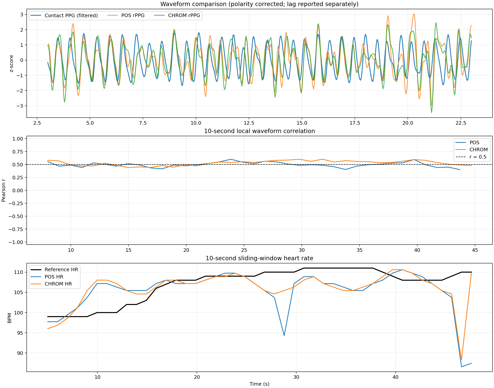
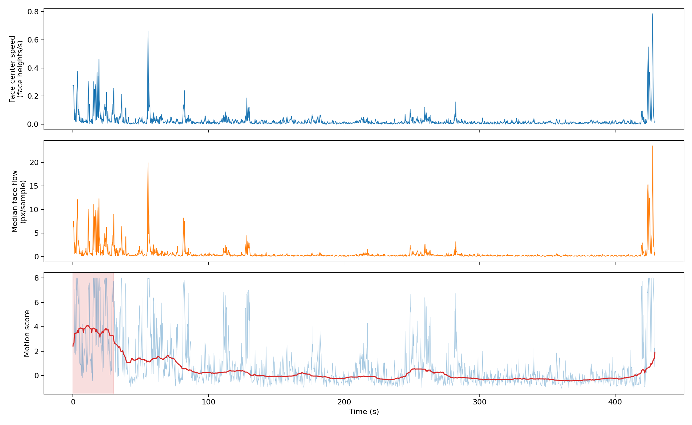
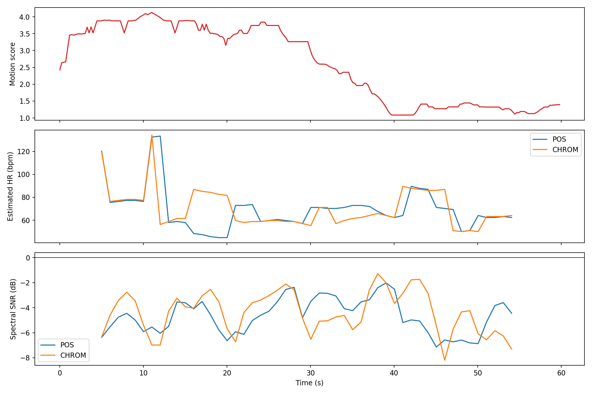

# rPPG 静态验证与动态实验对比汇总

> 最后同步：2026-09-03。本文档已汇总当前 WSL 工程中的数据、程序、结果、限制与复现方法。

## 1. 实验目的

本阶段实验用于验证以下两点：

1. 普通 RGB 摄像头拍摄的人脸视频，能否通过现有开源算法提取 rPPG 信号并估计心率；
2. 在静止、步行和跑步机不同速度条件下，rPPG 的误差、运动伪影和失效程度如何变化。

当前已完成 UBFC-rPPG 真人视频的准静态验证。该视频包含同步接触式 PPG 和参考心率，可用于定量比较。

> 注意：当前视频为坐姿、运动较少的准静态视频，但并非严格生理静息。参考心率约为 97～113 bpm，并随时间上升。

## 2. 是否使用 AI 进行比较

比较结果不是由生成式 AI 主观判断得出的，而是由可重复运行的信号处理与统计程序计算得到。

AI/机器学习仅用于：

- MediaPipe Face Mesh 检测人脸关键点；
- 根据关键点定位额头、左脸颊和右脸颊皮肤区域。

rPPG 提取和对比使用确定性算法：

- POS（Plane-Orthogonal-to-Skin）；
- CHROM（Chrominance-based rPPG）；
- Butterworth 带通滤波；
- Welch 功率谱估计；
- 互相关时间对齐；
- Pearson 相关系数、MAE、RMSE、MAPE、SNR、相干性和 Bland–Altman 分析。

因此，同样的输入数据和参数会得到相同的结果。

## 3. 当前数据

| 项目 | 数值 |
|---|---:|
| 视频长度 | 52.86 s |
| 视频帧数 | 1547 |
| 分辨率 | 640×480 |
| 帧率 | 29.264 fps |
| 人脸检测率 | 100% |
| 标准数据点数 | 1547 |
| 标准心率平均值 | 106.70 bpm |
| 标准心率中位数 | 108.00 bpm |
| 标准心率范围 | 97～113 bpm |

标准文件 `ground_truth.txt` 包含三行：

1. 接触式传感器 PPG 波形；
2. 参考心率；
3. 时间戳。

## 4. 数据对比方法

### 4.1 心率层面

使用 10 秒滑动窗口、1 秒步长进行比较：

1. 在每个窗口内使用 Welch 频谱寻找 rPPG 主频；
2. 将主频乘以 60 得到摄像头估计心率；
3. 取同一时间窗口内标准心率的中位数；
4. 计算每个窗口的心率误差。

主要指标：

- 绝对误差：`|HR_rPPG - HR_reference|`；
- MAE：所有窗口绝对误差的平均值；
- RMSE：对大误差更加敏感；
- MAPE：相对百分比误差；
- Bias：平均有符号误差，用于判断整体高估或低估；
- Bland–Altman 一致性界限；
- 误差不超过 5 bpm、10 bpm 的窗口比例；
- 有效输出覆盖率。

### 4.2 波形层面

rPPG 与接触式 PPG 的原始幅值单位不同，不能直接比较原始幅值。比较前执行：

1. 两个信号使用相同的 0.7～3.5 Hz 带通滤波；
2. 去除首尾各 3 秒滤波边缘；
3. 分别进行 z-score 标准化；
4. 允许极性翻转；
5. 使用互相关在 ±2 秒内寻找最佳时间延迟。

主要指标：

- Pearson 波形相关系数；
- 10 秒局部波形相关系数；
- 标准化波形 RMSE；
- 心率基频处的相干性；
- 主频误差；
- SNR。

极性翻转通常不代表错误，因为摄像头颜色变化方向和接触式传感器电压方向没有统一符号。时间偏移可能来自设备同步、脉搏传导和算法窗口处理。

## 5. 当前准静态视频实测结果

### 5.1 心率结果

| 指标 | POS | CHROM | 评价 |
|---|---:|---:|---|
| 摄像头中位心率 | 107.17 bpm | 107.17 bpm | 接近标准值 |
| 整段中位数绝对误差 | 0.83 bpm | 0.83 bpm | 优秀 |
| 整段频谱峰误差 | 0.21 bpm | 0.21 bpm | 优秀 |
| 10 秒滑窗 MAE | 3.92 bpm | 3.18 bpm | 良好 |
| 滑窗 RMSE | 6.34 bpm | 4.80 bpm | CHROM 更稳定 |
| MAPE | 3.65% | 2.99% | 良好 |
| Bias | −1.78 bpm | −1.02 bpm | 略微低估 |
| 误差不超过 5 bpm 的窗口 | 77.3% | 81.8% | POS 一般，CHROM 基本可用 |
| 有效输出率 | 100% | 100% | 良好 |

整段中位数误差很小，但它会掩盖局部失效。因此正式实验必须报告滑窗误差，不能只报告整段平均值或中位数。

### 5.2 波形结果

| 指标 | POS | CHROM | 评价 |
|---|---:|---:|---|
| 零延迟波形相关系数 | −0.472 | 0.533 | POS 存在极性翻转 |
| 对齐后波形相关系数绝对值 | 0.474 | 0.533 | 弱到中等 |
| 最佳相对时间偏移 | 约 0.58 s | 0 s | POS 需要额外对齐 |
| 10 秒局部相关系数中位数 | 0.493 | 0.538 | CHROM 略好 |
| 局部相关系数 ≥0.5 的比例 | 43.2% | 65.8% | CHROM 更稳定 |
| 心率基频相干性 | 0.731 | 0.791 | 中等偏好 |
| 标准化波形 RMSE | 1.025 | 0.967 | 仍有明显形态误差 |
| 中位 SNR | −3.71 dB | −3.11 dB | 噪声明显 |

这说明摄像头信号包含正确的心率主频，但每个脉搏周期的相位、幅度和形状不能完全还原接触式 PPG。

## 6. 具体不吻合区段

| 时间 | 标准心率 | POS/CHROM 结果 | 误差表现 |
|---|---:|---:|---|
| 约 9～12 s | 99～100 bpm | 105～108 bpm | 两种算法均高估约 6～8 bpm |
| 约 28.8 s | 110 bpm | POS 94.3 bpm | POS 低估 15.7 bpm |
| 约 46.6 s | 110 bpm | POS 86.6、CHROM 88.3 bpm | 两种算法同时低估约 22～23 bpm |
| 约 47.6 s | 110 bpm | POS 87.4 bpm | POS 尚未恢复，低估约 22.6 bpm |

结尾失效时 POS 和 CHROM 的 SNR 分别下降至约 −6.1 dB 和 −8.3 dB。算法在此处选择了错误的低频峰，而不是实际心率峰。

## 7. 建议采用的好坏阈值

以下阈值适合作为本项目的工程判据，不是医疗诊断标准。

### 7.1 心率指标

| 指标 | 优秀 | 可接受 | 较差/失效 |
|---|---:|---:|---:|
| 静态 MAE | ≤3 bpm | 3～5 bpm | >5 bpm |
| 动态 MAE | ≤5 bpm | 5～10 bpm | >10 bpm |
| MAPE | ≤5% | 5～10% | >10% |
| 误差≤5 bpm 窗口比例 | ≥90% | 80%～90% | <80% |
| 有效输出率 | ≥95% | 80%～95% | <80% |
| Bias | 最好在 ±2 bpm 内 | ±2～5 bpm | 超过 ±5 bpm |
| Bland–Altman 界限 | 约 ±5 bpm | 约 ±10 bpm | 超过 ±10 bpm |

### 7.2 波形指标

| 指标 | 好 | 中等 | 差 |
|---|---:|---:|---:|
| Pearson 相关系数 | ≥0.8 | 0.5～0.8 | <0.5 |
| 基频相干性 | ≥0.8 | 0.5～0.8 | <0.5 |
| SNR | ≥3 dB | 0～3 dB | <0 dB |
| 局部相关系数≥0.5比例 | ≥80% | 50%～80% | <50% |

## 8. 当前视频是否通过

若实验目标是证明普通摄像头能够估计心率：**通过**。

- 整段心率误差小于 1 bpm；
- 滑窗 MAE 约 3.2～3.9 bpm；
- 人脸检测和有效输出率均为 100%；
- CHROM 总体优于 POS。

若实验目标是证明能够高保真重建接触式 PPG 波形：**尚未通过**。

- 波形相关性只有约 0.47～0.53；
- SNR 为负；
- 局部出现超过 20 bpm 的心率错误；
- 逐周期波形形态仍有明显差异。

因此当前阶段最准确的结论是：

> 普通摄像头能够提取包含有效心率主频的 rPPG 信号，并较准确地估计平均心率，但逐周期 PPG 波形质量和短时稳定性仍有限。

## 9. 运动伪影最直观的评价数据

### 9.1 最直观的单项数据

推荐使用 10 秒滑窗绝对心率误差：

```text
absolute_error(t) = |HR_rPPG(t) - HR_reference(t)|
```

将它与跑步机速度同时画在时间轴上，可以直接看出算法从何时开始失效。

### 9.2 最直观的汇总数据

推荐计算失效窗口比例：

```text
failure_rate = 误差超过10 bpm的窗口数 / 全部窗口数
```

最终可形成如下结果表：

| 速度 | HR MAE | 最大误差 | 误差>10 bpm比例 | 有效输出率 | 中位SNR |
|---:|---:|---:|---:|---:|---:|
| 静止 | 待测 | 待测 | 待测 | 待测 | 待测 |
| 慢走 | 待测 | 待测 | 待测 | 待测 | 待测 |
| 快走 | 待测 | 待测 | 待测 | 待测 | 待测 |
| 慢跑 | 待测 | 待测 | 待测 | 待测 | 待测 |

### 9.3 推荐同时绘制的动态曲线

1. 跑步机速度；
2. 标准心率和摄像头心率；
3. 滑窗绝对心率误差；
4. SNR；
5. 人脸检测率；
6. 头部位移或面部光流强度；
7. 10 秒局部波形相关系数。

当速度或光流升高，同时出现 SNR 下降、波形相关性下降和心率误差增大时，可以较明确地证明失效由运动伪影导致。

## 10. 静态与动态实验的统一方案

### 10.1 数据采集

- 每种状态至少记录 60～120 秒；
- 每个条件建议重复 3 次；
- 固定摄像头距离、角度、曝光和照明；
- 同步记录视频和标准设备；
- 动态参考设备优先使用胸带 ECG 或耳部 PPG；
- 手指夹式 PPG 在跑步时也可能产生运动伪影，应避免把参考设备失效误认为摄像头失效。

### 10.2 状态划分

- 静止；
- 慢走；
- 快走；
- 慢跑；
- 速度切换过渡段；
- 停止运动后的恢复段。

恒速段和速度切换段必须分开评价，避免用整段平均值掩盖瞬时失效。

### 10.3 建议的动态失效判据

连续窗口满足任一条件，可判定算法出现动态失效：

- 心率误差持续超过 10 bpm；
- 有效输出率低于 80%；
- 波形相关系数持续低于 0.3；
- 心率基频相干性持续低于 0.4；
- 人脸或皮肤 ROI 检测率明显下降；
- 错误持续多个窗口且不能快速恢复。

## 11. 结果文件

- `results/vid/comparison/detailed_comparison.png`：标准波形、rPPG、局部相关性和滑窗心率对比图；
- `results/vid/comparison/comparison_metrics.json`：完整数值指标；
- `results/vid/comparison/hr_window_comparison.csv`：逐窗口标准心率、摄像头心率和误差；
- `results/vid/comparison/pos_waveform_window_comparison.csv`：POS 局部波形相关性；
- `results/vid/comparison/chrom_waveform_window_comparison.csv`：CHROM 局部波形相关性；
- `analyze_ubfc_alignment.py`：可重复运行的对齐与评价程序。

## 12. 总结

1. 当前准静态视频能够证明普通摄像头可以提取 rPPG 并估计心率；
2. 整段心率非常准确，但存在短时严重错误，最大误差约 22～23 bpm；
3. CHROM 的滑窗 MAE、RMSE、波形相关性和相干性整体优于 POS；
4. 当前波形质量仅达到弱到中等水平，不能宣称等价于接触式 PPG；
5. 动态实验应以滑窗绝对心率误差、失效窗口比例、SNR、局部波形相关性和光流运动量为核心指标；
6. 最终应绘制误差随跑步机速度或运动强度变化的曲线，确定算法从哪个速度开始明显失效。

## 13. 新下载的动作候选视频筛选结果（2026-09-03）

### 13.1 文件与来源

- 来源：Kaggle `ashfakyeafi/rppg-dataset` 的 `subject_001/trial_001`；
- 原视频：`videos/kaggle_motion_subject001/video.mov`；
- 参数：H.264、1920×1080、29.97 fps、429.33 s、约 514 MiB；
- 同一试验目录在 Kaggle 中包含 `empatica_e4` 和 `video` 两个子目录，说明采集时配有 Empatica E4 接触式传感器；
- Kaggle 页面没有数据说明，许可标为 Unknown。因此它目前只适合作为内部候选样本，不能在论文中直接当作来源完备的公开标准数据集。

Google Drive 上的 UBFC `5-gt` 动作候选目录可以看到 `vid.avi`（2.07 GB）和 `gtdump.xmp`（76 KB），但实际文件服务器在当前网络返回 HTTP 下载错误。本次未把目录可见误写成下载成功。

### 13.2 是否真正包含运动

对整段视频以约 4.28 Hz 抽样，使用 MediaPipe 人脸关键点与脸部稠密光流进行扫描：

| 动作指标 | 原静息 UBFC subject1 | 新候选视频 | 倍数/评价 |
|---|---:|---:|---|
| 人脸检测率 | 100% | 100% | 均未丢脸 |
| 人脸中心速度中位数（脸高/s） | 0.0132 | 0.0129 | 日常状态整体接近静止 |
| 人脸中心速度 P95（脸高/s） | 0.0360 | 0.0817 | 新视频约 2.27 倍 |
| 脸部光流中位数（px/抽样间隔） | 0.262 | 0.217 | 日常状态并不更高 |
| 脸部光流 P95（px/抽样间隔） | 0.803 | 2.401 | 新视频约 2.99 倍 |

自动定位的最强动作区间为 **0～30 s**。其中约 15～24 s 出现多次大幅动作，局部脸部光流达到约 4～12 px/抽样间隔。30 s 以后整体趋于稳定。

结论：这个视频包含明显的短时头部/身体动作，适合做“动作突发干扰”压力测试；但它不是连续走路、跑步或跑步机恒速视频，不能代替最终跑步机实验。

### 13.3 动作最强前 60 秒的 rPPG 结果

已把前 60 秒缩放到 640 宽后，使用与静态实验相同的 POS 和 CHROM 流程分析：

| 指标 | POS | CHROM |
|---|---:|---:|
| 人脸检测率 | 100% | 100% |
| 整段中位心率 | 68.49 bpm | 63.22 bpm |
| 心率标准差 | 18.36 bpm | 16.56 bpm |
| 中位 SNR | −4.68 dB | −4.31 dB |
| 前半段（动作较强）心率标准差 | 24.25 bpm | 19.20 bpm |
| 后半段（较稳定）心率标准差 | 9.23 bpm | 12.68 bpm |

按动作量上四分位与下四分位比较：

- POS 心率标准差由低动作的 10.14 bpm 增至高动作的 28.82 bpm，约 2.84 倍；
- CHROM 心率标准差由 13.20 bpm 增至 22.22 bpm，约 1.68 倍；
- 两种方法都出现明显的心率峰跳变，POS 对该动作更敏感；
- SNR 没有随动作单调下降，所以本样本再次说明：**不能只用 SNR 判断动态失效，必须结合标准心率误差或至少结合心率跳变和算法间一致性。**

### 13.4 当前能下的结论与不能下的结论

可以下的结论：

> 突发头部/身体动作会显著增加传统 POS/CHROM 输出的短时心率波动；在本候选视频中，高动作窗口的心率离散度约为低动作窗口的 1.68～2.84 倍。

暂时不能下的结论：

- 不能报告 MAE、RMSE、MAPE、Bias 或 Bland–Altman 界限，因为该候选试验的 Empatica BVP/HR 文件尚未成功落地；
- 不能断言 63～68 bpm 中哪个更接近真实值；
- 不能将该结果等同于跑步机速度分级实验。

### 13.5 本次新增文件

- `scan_motion.py`：整段动作扫描与最强区间定位；
- `assess_motion_candidate.py`：动作量与 POS/CHROM 心率、SNR 的逐窗关联；
- `videos/kaggle_motion_subject001/video.mov`：新下载原视频；
- `videos/kaggle_motion_subject001/clips/motion_first60.mp4`：动作最强区间分析片段；
- `results/kaggle_motion_subject001/motion_scan/motion_scan.png`：整段动作曲线；
- `results/kaggle_motion_subject001/motion_effect/motion_vs_rppg.png`：动作、估计心率和 SNR 联合图；
- `results/kaggle_motion_subject001/motion_effect/motion_effect_summary.json`：动态筛选数值汇总。

## 14. 当前工程完整同步清单

### 14.1 当前进度总览

| 环节 | 数据 | 是否有标准真值 | 当前状态 | 能回答的问题 |
|---|---|---:|---|---|
| 程序自检 | 20 s、72 bpm 合成视频 | 有，生成频率为 72 bpm | 已完成 | 程序能否正确恢复已知周期 |
| 真人准静态验证 | UBFC-rPPG subject1 | 有，同步 PPG 与心率 | 已完成 | 普通摄像头在低运动条件下能否较准确估计心率 |
| 动作伪影筛选 | Kaggle subject_001/trial_001 | 暂无本地真值 | 已完成候选分析 | 动作增强时输出是否更不稳定 |
| 跑步机分级实验 | 静止、慢走、快走、慢跑 | 尚未采集 | 未完成 | 算法在哪个速度开始出现可量化失效 |

因此，目前已经完成“可提取性 + 静态准确性 + 突发动作失效趋势”的验证；还缺“同步接触式真值下的跑步机不同速度定量比较”。

### 14.2 合成 72 bpm 程序自检

输入：`videos/self_test_72bpm.mp4`，30 fps，600 帧，20 s。该视频仅用于检查处理链路，不代表真人皮肤、生理变化或真实摄像头噪声。

| 指标 | POS | CHROM |
|---|---:|---:|
| 人脸检测率 | 100% | 100% |
| 中位心率 | 72.070 bpm | 72.070 bpm |
| 相对 72 bpm 绝对误差 | 0.070 bpm | 0.070 bpm |
| 心率标准差 | 0.339 bpm | 0.000 bpm |
| 中位 SNR | 7.27 dB | 8.30 dB |

这组结果证明代码、滤波和频谱寻峰链路工作正常，但不能替代真人数据验证。

### 14.3 三类数据的核心结果汇总

| 数据 | POS | CHROM | 解释 |
|---|---|---|---|
| 合成 72 bpm | 中位 72.070，SNR 7.27 dB | 中位 72.070，SNR 8.30 dB | 两种算法均通过程序自检 |
| UBFC 真人准静态 | 滑窗 MAE 3.92 bpm，RMSE 6.34 bpm，波形 \|r\| 0.474 | 滑窗 MAE 3.18 bpm，RMSE 4.80 bpm，波形 r 0.533 | CHROM 整体优于 POS；整段心率准，但局部会失效 |
| 动作候选前 60 s | 中位 68.49 bpm，HR 标准差 18.36 bpm | 中位 63.22 bpm，HR 标准差 16.56 bpm | 无真值，不能判断哪个心率更准，只能评估稳定性 |
| 高动作/低动作离散度 | 28.82/10.14 bpm，约 2.84 倍 | 22.22/13.20 bpm，约 1.68 倍 | 动作明显放大短时心率波动，POS 更敏感 |

### 14.4 关键图

UBFC 标准 PPG、rPPG 波形、局部相关性和滑窗心率定量对比：



新候选视频整段动作强度与最强区间：



动作量、POS/CHROM 心率和 SNR 的逐窗联合结果：



### 14.5 程序文件及用途

| 文件 | 用途 |
|---|---|
| `analyze_rppg.py` | 检测人脸 ROI，以 POS 或 CHROM 提取 rPPG，输出波形、滑窗心率、SNR 和报告图 |
| `run.sh` | 对单个视频执行标准 rPPG 流程的快捷入口 |
| `make_self_test_video.py` | 生成已知 72 bpm 的无隐私合成自检视频 |
| `compare_ubfc.py` | 对 UBFC 参考心率与单个算法摘要做基础比较 |
| `analyze_ubfc_alignment.py` | 将 POS/CHROM 与 UBFC 接触式 PPG 对齐，计算完整波形和心率指标 |
| `scan_motion.py` | 用人脸中心位移和脸部光流扫描整段视频，定位最强动作窗口 |
| `assess_motion_candidate.py` | 合并动作量、POS/CHROM 心率与 SNR，比较高低动作窗口 |
| `requirements.txt` | Python 依赖列表 |
| `.venv/` | 已部署的 WSL Python 隔离环境 |

### 14.6 数据与输出目录

主要输入数据：

- `videos/self_test_72bpm.mp4`：72 bpm 合成自检视频，约 3.0 MiB；
- `videos/ubfc_subject1/vid.avi`：UBFC subject1 真人视频，约 1.33 GiB；
- `videos/ubfc_subject1/ground_truth.txt`：同步接触式 PPG、参考心率与时间信息；
- `videos/kaggle_motion_subject001/video.mov`：动作候选原视频，约 514 MiB；
- `videos/kaggle_motion_subject001/clips/motion_first60.mp4`：用于压力测试的前 60 s 缩放片段。

输出目录结构：

```text
results/
├── self_test_72bpm/
│   ├── pos/                 # 合成视频 POS 结果
│   └── chrom/               # 合成视频 CHROM 结果
├── vid/
│   ├── pos/                 # UBFC POS 波形、心率、摘要和报告图
│   ├── chrom/               # UBFC CHROM 波形、心率、摘要和报告图
│   └── comparison/          # 与同步真值的完整定量比较
├── ubfc_subject1_motion_scan/ # UBFC 静态基线的动作扫描
└── kaggle_motion_subject001/
    ├── motion_scan/         # 候选视频整段动作扫描
    ├── pos_first60/         # 动作片段 POS 结果
    ├── chrom_first60/       # 动作片段 CHROM 结果
    └── motion_effect/       # 动作量与 rPPG 输出的联合分析
```

每个 POS/CHROM 结果目录通常包含：

- `rppg_waveform.csv`：逐帧时间、RGB 特征及归一化 rPPG 波形；
- `heart_rate.csv`：逐滑窗心率和频谱 SNR；
- `summary.json`：视频参数、人脸检出率和心率统计；
- `rppg_report.png`：波形、心率和质量概览。

### 14.7 在 WSL 中复现

```bash
cd /home/fengbujue/项目/rppg识别

# 任意视频：分别运行 POS 和 CHROM
./run.sh videos/你的文件.mp4 pos
./run.sh videos/你的文件.mp4 chrom

# 重新生成并分析 72 bpm 合成自检视频
.venv/bin/python make_self_test_video.py
./run.sh videos/self_test_72bpm.mp4 pos
./run.sh videos/self_test_72bpm.mp4 chrom

# 重新分析 UBFC subject1
./run.sh videos/ubfc_subject1/vid.avi pos
./run.sh videos/ubfc_subject1/vid.avi chrom
.venv/bin/python analyze_ubfc_alignment.py \
  videos/ubfc_subject1/ground_truth.txt \
  --pos-dir results/vid/pos \
  --chrom-dir results/vid/chrom \
  --output results/vid/comparison

# 扫描动作候选整段视频
.venv/bin/python scan_motion.py \
  videos/kaggle_motion_subject001/video.mov \
  --output results/kaggle_motion_subject001/motion_scan

# 已有前 60 s 分析结果时，重新计算动作影响
.venv/bin/python assess_motion_candidate.py \
  --motion results/kaggle_motion_subject001/motion_scan/motion_timeseries.csv \
  --pos results/kaggle_motion_subject001/pos_first60/heart_rate.csv \
  --chrom results/kaggle_motion_subject001/chrom_first60/heart_rate.csv \
  --output results/kaggle_motion_subject001/motion_effect
```

### 14.8 当前限制与下一步

1. Kaggle 动作候选的 Empatica E4 文件尚未下载到本地，因此运动段没有可用于 MAE、RMSE 和 Bland–Altman 的同步真值；
2. 该视频是短时动作干扰，不是跑步机恒速步行/跑步，不能回答“从哪个速度开始失效”；
3. 下一步应对同一受试者同步拍摄普通摄像头与 Polar、ECG、指夹式 PPG 或 Empatica，至少包含静止、慢走、快走、慢跑四档；
4. 每档建议保留 90～120 s 稳态段，并单独标记加速、减速和恢复段；
5. 最终按速度报告 MAE、RMSE、Bias、95% 一致性界限、误差超过 10 bpm 的窗口比例、有效输出率、局部波形相关性、相干性及运动量；
6. 当前最可靠的阶段性结论仍是：普通摄像头在低运动条件下可获得较准确的心率估计，但局部误差和波形失真不可忽略；突发动作会显著放大传统 rPPG 的心率波动。

### 14.9 外部来源与许可提醒

- 算法路线参考开源项目：[pyVHR](https://github.com/phuselab/pyVHR)；
- 静态标准数据来自 UBFC-rPPG；
- 动作候选来自 [Kaggle rPPG Dataset](https://www.kaggle.com/datasets/ashfakyeafi/rppg-dataset)；
- Kaggle 页面当前显示许可 Unknown，正式论文、公开演示或再分发前必须再次核对授权；
- 摄像头 rPPG 结果是研究性估计，不应作为医疗诊断数据。
