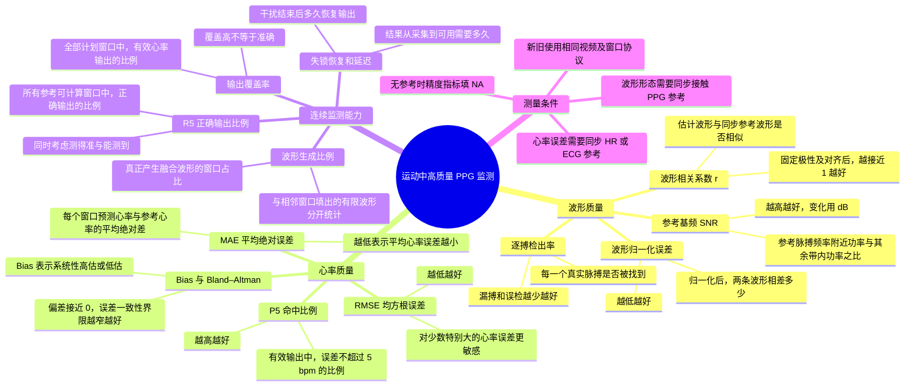
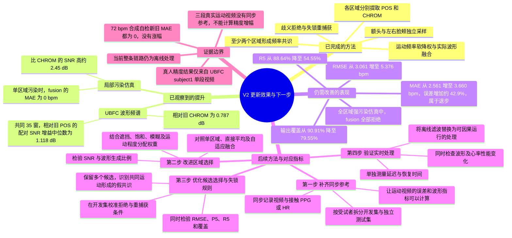

# rPPG 研究：指标与算法更新的两张思维导图

研究主线：通过更新代码，提高运动过程中 PPG 信号的监测质量，分别观察波形、心率及连续输出表现。

## 思维导图一：我的指标及其含义

分母约定：`Nplan` 是全部计划窗口；`Nref` 是参考心率可计算窗口；`Nvalid` 是参考可计算且算法接受并输出有限心率的窗口；`N5` 是其中绝对误差 ≤5 bpm 的窗口。`P5=N5/Nvalid`，`R5=N5/Nref`，`C_ref=Nvalid/Nref`。参考可计算不等于参考质量已经通过独立认证。

## 思维导图二：算法更新后的性能提升及后续方法

第二张图的真人数值默认对比“旧 POS + 离线 DP”与“V2 fusion 前向候选”，SNR 采用共同窗口逐窗配对差的中位数。仿真是已知频率的 RGB 混合信号，不能代替真人运动验证。

目前波形相关系数、形态误差和逐搏检出尚未获得经校验的同步形态参考，不能列作已经提升的指标。下一步方法为待实施的更新方案，不代表已经完成。

来源：[V2 完整分析报告](<C:/Users/15011/Documents/ChatGPT/New project/rPPG运动监测_V2升级与指标变化_2026-09-08.md>)；[HR 指标明细](<C:/Users/15011/Documents/ChatGPT/New project/rppg_motion_v2/evaluation/metrics.csv>)；[配对变化明细](<C:/Users/15011/Documents/ChatGPT/New project/rppg_motion_v2/evaluation/deltas.csv>)。
