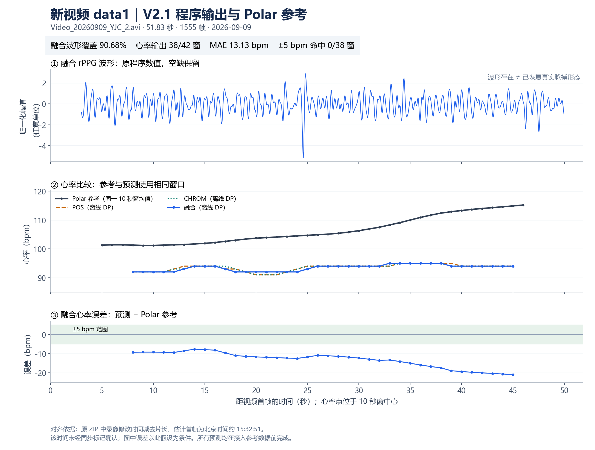
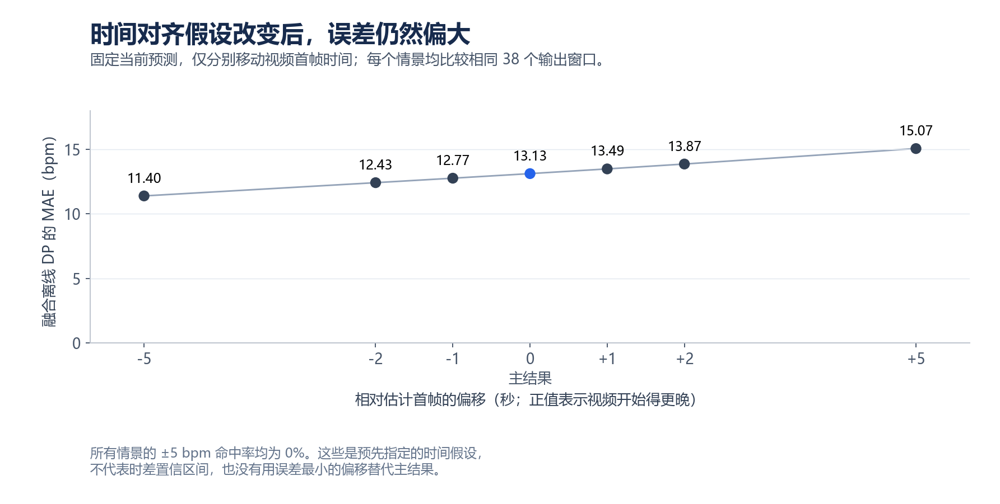

# data1 新视频：V2.1 输出与 Polar 参考比较

**程序已完成分析。在文件时间推断的对齐假设下，融合波形覆盖率为 90.68%，心率输出率为 90.48%，但心率平均低估 13.13 bpm，MAE 为 13.13 bpm。38 个有效输出窗口均未达到 ±5 bpm。**

| 本次分析对象 | 内容 |
|---|---|
| 数据来源 | 用户提供的 `data1.zip` |
| 视频 | `Video_20260909_YJC_2.avi`，51.83 秒，1555 帧，约 30 fps，3840×2160 |
| 程序 | 项目 `run_motion_v21.sh`，`multi_roi_v2.1`；7 个源码文件哈希核对一致 |
| 运行方式 | 先用视频独立推理；参考数据只在之后用于评分，没有改阈值、重跑拟合或调整算法 |
| 用户指定参考 | `polar_hr.csv` 的 Polar Sense 心率通知值，按宿主机 UTC 时间匹配 |
| 评估窗口 | 长 10 秒、步长约 1 秒；42 个计划窗，42 个有参考，其中 38 个有程序输出 |
| 时间状态 | 估计对齐，尚无经确认的同步标记 |

## 1. 最简指标表

| 指标 | 含义 | 本片融合结果 |
|---|---|---:|
| 直接人脸检出率 | 本帧实际检出人脸的帧数 / 总帧数 | 1402/1555，90.16% |
| 人脸区域 RGB 可用率 | 包括光流延续在内、可取得 ROI 颜色的帧数 / 总帧数 | 1514/1555，97.36% |
| 波形覆盖率 | 保存波形中非空采样数 / 总帧数 | 1410/1555，90.68% |
| 心率输出率 | 有效心率输出窗 / 计划窗 | 38/42，90.48% |
| MAE ↓ | 心率绝对误差的平均值 | 13.13 bpm |
| RMSE ↓ | 对大误差更敏感的均方根误差 | 13.71 bpm |
| Bias 接近 0 | 平均预测值减参考值；负值为低估 | -13.13 bpm |
| ±5 bpm 命中率 P5 ↑ | 误差不超过 5 bpm 的窗 / 有效比较窗 | 0/38，0% |
| 全程 ±5 bpm 有效率 R5 ↑ | 误差不超过 5 bpm 的窗 / 全部有参考窗 | 0/42，0% |
| 参考频率 SNR ↑ | 参考心率基频附近能量 / 其余心率频带能量，取 dB | 均值 -13.38 dB |
| 波形相关系数 r | 与接触式 PPG 对齐后的形态相关性 | 未评分：跨部位波形时延、通道与相位协议未确认 |
| 真实伪影能量降低量 | 对照可确认的干净波形，比较伪影减少多少 | 未评分：本片没有对应干净波形基线 |

前四项反映程序能否产生数据。误差和命中率反映产生的数据是否接近参考，不能把 90% 的输出覆盖率当成 90% 的心率准确率。

## 2. 同一新视频的全部算法分支

表内 MAE、RMSE、Bias 单位均为 bpm；误差定义为“预测 − 参考”。所有分支均使用同一组 38 个比较窗；各自有效窗与严格共同窗的结果一致，4 个拒绝窗口保留为空值。

| 算法 / 读出方式 | 比较窗 / 计划窗 | MAE ↓ | RMSE ↓ | Bias | ±5 bpm 命中率 ↑ |
|---|---:|---:|---:|---:|---:|
| POS / 局部频谱峰 | 38/42 | 12.97 | 13.58 | -12.97 | 0.00% |
| POS / 离线 DP | 38/42 | 13.08 | 13.67 | -13.08 | 0.00% |
| CHROM / 局部频谱峰 | 38/42 | 13.08 | 13.70 | -13.08 | 0.00% |
| CHROM / 离线 DP | 38/42 | 13.10 | 13.71 | -13.10 | 0.00% |
| 多 ROI 融合 / 局部频谱峰 | 38/42 | 13.29 | 13.90 | -13.29 | 0.00% |
| 多 ROI 融合 / 离线 DP | 38/42 | 13.13 | 13.71 | -13.13 | 0.00% |

融合离线 DP 的 95% 绝对误差分位为 **20.34 bpm**，最大绝对误差为 **20.90 bpm**；Bland–Altman 描述性一致性界限为 **[-20.97, -5.29] bpm**。重叠窗口不是独立受试者，这里只描述本段视频。

| 波形方法 | 波形覆盖率 | 参考频率 SNR 均值（dB） | SNR 中位数（dB） | SNR 比较窗 |
|---|---:|---:|---:|---:|
| POS | 92.03% | -12.81 | -11.89 | 38 |
| CHROM | 92.03% | -11.82 | -9.85 | 38 |
| 多 ROI 融合 | 90.68% | -13.38 | -13.17 | 38 |

SNR 按现有定义计算：每个完整 10 秒窗使用 Hann 窗频谱，NFFT=8192；0.7–3.5 Hz 内，以参考心率基频 ±0.1 Hz 为信号区，其余为分母。负值说明参考基频附近能量弱于带内其他频率能量；它不是经过标定的真实运动伪影能量。三种波形使用相同的 38 个 SNR 评分窗。

## 3. 自动判断时间的依据

原始视频内层 ZIP 保存的 Unix 修改时间对应北京时间 **2026-09-09 15:33:43**；减去视频时长 51.8332815 秒，得到估计首帧 **约 15:32:51**，约比 Polar 会话开始晚 **60.41 秒**。这使用原压缩包记录，没有使用解压后文件的修改时间。

参考文件的归档修改秒与其最后通知/会话结束秒相符，支持原归档时间接近采集时间。但视频容器没有绝对录制时刻，抽查帧也未发现时钟或同步标记；文件落盘延迟和不同设备时钟差仍未知。因此主结果固定使用该估计，并列出事先指定的时间偏移情景：

| 相对估计首帧的偏移（秒） | 融合离线 DP MAE（bpm） | ±5 bpm 命中率 |
|---:|---:|---:|
| -5 | 11.40 | 0.00% |
| -2 | 12.43 | 0.00% |
| -1 | 12.77 | 0.00% |
| +0 | 13.13 | 0.00% |
| +1 | 13.49 | 0.00% |
| +2 | 13.87 | 0.00% |
| +5 | 15.07 | 0.00% |

正值表示视频在参考时间轴上开始得更晚。每个情景仍是同一组 38 个程序输出、42 个有参考窗。上述情景的 MAE 为 **11.40–15.07 bpm**；它不是时差的置信区间或最大误差边界，也没有选最优偏移替换主结果。

参考窗取 `[中心−5秒, 中心+5秒)` 内有效正心率的算术均值。以原始整数 UTC 纳秒减去估计视频首帧，再转为相对秒，避免各自归零或大浮点时间造成错配。Polar 心率通知含设备内部处理延迟，但文件没有可用于校正该延迟的字段。

## 4. 本片显示的问题与下一步代码方向

本片融合 DP 输出为 **92–95 bpm**，同窗参考均值为 **101.2–114.9 bpm**。局部频谱峰在 DP 之前也集中于约 91–96 bpm，因此不能只归因于 DP 平滑。

现有候选日志显示，35 个接受提议均为 91–96 bpm，并有两个或三个 ROI 共同支持；保留候选中 100–113 bpm 的峰仅出现在 5 个窗口，而且每窗只来自一个 ROI。这支持“多个通道共同突出较低频分量”的判断，尚不足以确认它就是步频。

后续代码工作应优先检查共同运动/光照分量是否主导候选选择，补充 ROI 运动、亮度与候选频率的诊断，再检验候选保留及置信门控；不能直接把输出加 13 bpm，也不能把结果强行调到参考频率。本次仅完成冻结程序验证，上述改动尚未实施。新片与之前的 9 月 7 日视频不是同一测试集，覆盖率变化不能直接当作算法升级的效果。

## 5. 交付文件

- `program/`：POS、CHROM、融合的原始波形和心率 CSV；保留全部空值与拒绝窗口，未额外平滑。
- `evaluation/metrics.csv`：6 分支主指标；`common_metrics.csv`：严格共同窗结果。
- `evaluation/aligned_windows.csv`：252 行逐分支逐窗比较，含参考、预测、误差和有效标记。
- `evaluation/reference_windows.csv`：全部 7 种时间假设的逐窗参考；`reference_aligned.csv`：原通知心率及主对齐相对时间。
- `evaluation/waveform_snr.csv` 与 `waveform_windows.csv`：波形 SNR 汇总与逐窗值。
- `evaluation/sensitivity*.csv`：固定时间偏移结果；`alignment_protocol.json`：对齐与评分定义。
- `comparison_qa.md/json`：独立计算的核对记录；`bundle_manifest.json`：导出文件 SHA-256。

原始视频和完整参考数据保留在分析目录 `inputs/`。分享包不含面部帧、原视频或设备连接信息。
