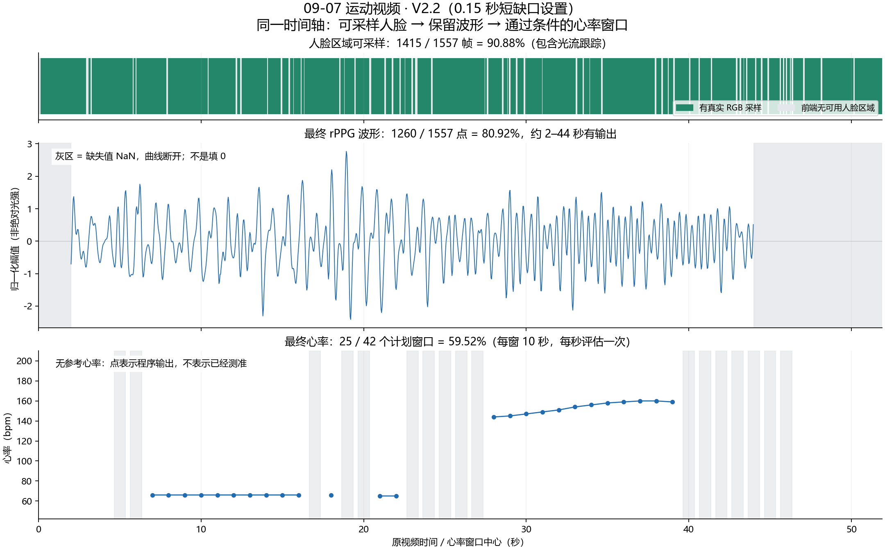

# 人脸、波形、心率三个比例怎样理解

使用上轮现有方法对比中，09-07 运动视频连续性较好的 **V2.2，0.15 秒短缺口设置，融合波形分支**。它并不是所有视频、所有指标上的最优模型；这段没有参考心率，只能核实输出与连续性，无法判定谁的准确率最高。

最关键的区别：**人脸比例统计可采样帧，波形比例统计保留的波形点，心率比例统计通过条件的时间窗口。缺失输出保留为空值，而不是填 0。**

| 指标 | 此版本结果 | 分母与含义 |
|---|---:|---|
| 人脸区域可采样率 | 90.88% | 1415 / 1557 帧成功取得脸部区域 RGB，包含检测和光流跟踪。不是人脸身份识别准确率，也不是纯检测器每帧独立检出的比例。 |
| 最终融合波形覆盖率 | 80.92% | 1260 / 1557 个时间点保留波形值，对应约 42 秒 / 全片 51.90 秒。它是输出覆盖，不是已经证明正确的脉搏比例。 |
| 最终心率输出覆盖率 | 59.52% | 42 个计划窗口里 25 个通过固定条件并有心率。每窗约 10 秒、步长约 1 秒，窗口重叠；不能解释为整片 59.52% 的时间心率一定正确。 |

较早 V2.1 的同片结果才是“90.88%、57.80%、28.57%”。你之前说的约 90%、50%、30% 对应的是这类旧结果，不能与新版本混用。如果将“波形覆盖率”直接叫成“PPG质量百分比”，是不准确的。

## 有波形的时间和没有波形的时间

当前这份输出中，约 **2.00–44.00 秒**保留最终融合波形，共 1260 点；约 0–2 秒以及 44–51.90 秒没有最终波形值。边界用原始帧时钟计算，图文显示四舍五入后的秒数。

保留的 1260 点里，有 1149 点标记为原始观测贡献，111 点标记为短缺口插值贡献，约为 3.70 秒的采样点总量，分散在若干短缺口中。这不是一次性插值 3.70 秒；本配置只允许单个有界缺口不超过 0.15 秒，实际 30 fps 时最多 4 个缺失帧。80.92% 因而不能说成全部由不间断实测得到，更不能说成真实脉搏恢复正确率。

CSV 中有结果的 `base` 是归一化波形幅值，可以正、可以负，也可以正常穿过零。缺失时间点的 `base` 是空单元格，读入分析程序后为 `NaN`，同时 `covered=False`。绘图遇到这些 NaN 就断线，不会在缺失区画一条 0 线。图上的 0 幅值线只是波形坐标基准。

例如第 1 秒前端已经采到 RGB，但最终波形仍为空；约第 2 秒有实际波形值；约第 44 秒及第 50 秒又是“有 RGB、没有最终融合波形”。这些例子直接保存在配套 `核对数据.json` 中。

## 为什么波形连续，心率仍然缺失

心率需要分析一整段数据，不是读取当前单帧就得到结果。程序将 10 秒窗口逐秒滑动，检查窗口内的波形、实际观测比例、插值比例和频谱条件。

例如 CSV 中 `time_s` 约为 **17 秒**的一行代表约 **12–22 秒**窗口。该窗波形虽然完整，但实际观测比例为 **89.67%**，插值比例为 **10.33%**；未满足观测至少 90%、插值最多 10% 的条件，所以 `accepted=False`、`ridge_bpm` 为空。曲线能画出来，并不自动等于允许报告心率。

当前 25 个有效心率窗口的中心约在 7–16 秒、18 秒、21–22 秒和 28–39 秒。它们是窗口估计，不是这些时刻的逐搏或瞬时真值。程序使用离线滤波和离线动态规划，因此横坐标也不是实时程序输出到屏幕的时刻。

## 缺失既有前端问题，也有后续处理限制

| 所在阶段 | 本片记录 | 可以据此解释什么 |
|---|---|---|
| 人脸区域 / RGB | 142 帧没有可用人脸及有效跟踪 | 说明前端未提供可用区域；不等于视频中一定没有人脸。 |
| 最终波形缺失 | 297 点，其中 31 点同时没有可用 RGB，266 点已有 RGB | 不能把所有波形缺失都归为没抓到脸；窗口上下文、滤波边缘、ROI 可用条件和融合决策也影响是否保留。 |
| 最终 HR 拒绝：`gap_or_filter_edge` | 9 / 42 窗 | 该 10 秒窗未被最终波形完整覆盖，包括波形缺口或滤波边缘。 |
| 最终 HR 拒绝：`insufficient_observed_rgb` | 8 / 42 窗 | 波形有限，但原始观测比例不足，或短缺口插值比例超限。 |
| 最终 HR 接受：`candidate_only` | 25 / 42 窗 | 通过当前工程条件并报告候选心率；该名字不代表已用真值验证。 |

这版最终 HR 的 17 个拒绝窗就是上述 9 + 8。更上游的融合候选另记录了 17 个 `insufficient_rois` 和 7 个 `ambiguous_consensus`；它们属于另一阶段，邻近窗口的融合波形可能补足当前窗，因此不能把这些数量再与最终 17 个拒绝窗相加。具体模糊、姿态、运动伪影各自造成多少，需要进一步受控分析，不能从一个总状态直接确定物理原因。

## 程序真正输出什么文件

原结果目录：`rppg_motion_v22/validation/trimmed_gap15/user0907/`。

| 文件 | 每行代表什么 | 主要列 |
|---|---|---|
| `frame_trace.csv` | 一帧视频的跟踪与颜色采样记录 | `time_s`、`source`、`rgb_valid`、脸框、各 ROI 的 RGB / 有效性 |
| `fusion_waveform.csv` | 一个原视频采样时间点，共 1557 行 | `time_s`、`base`、`covered`、`observed`、`interpolated` |
| `fusion_heart_rate.csv` | 一个 10 秒计划窗口，共 42 行，拒绝行也保留 | `time_s`、`window_start_s`、`window_end_s`、`ridge_bpm`、`spectral_peak_bpm`、`accepted`、`status` |
| `fusion_proposals.csv` / `fusion_diagnostics.csv` | 融合前的候选与各通道诊断 | ROI 条件、候选频率、共识状态等；不能把候选直接当作最终心率 |
| `summary.json` | 整段视频的配置与计数汇总 | 帧数、帧率、比例、状态计数、版本等 |
| `comparison.png` | 原程序的可采样状态及各方法心率对比图 | 原图第一排的 0/1 是可采样标记，不是 PPG 波形幅值 |

本说明额外生成的时间轴图把实际保存的融合波形也画出来，以便直接看到缺失区；不是重新推理、生成假波形或改动原输出。所有缺失值、拒绝标记、采样点数和分母都已从原文件复核。

若要判断“这些波形是否形态正确、这些心率是否准确”，下一步仍需要与该视频同步的可靠参考。现有图能回答输出在哪里和为什么被拒绝，不能替代准确性验证。

## 补充：本片波形缺失是怎样逐级产生的

这里的“失败”主要指按规则不保留结果，并不是文件写入报错，也不意味着那一时刻完全不存在脉搏信息。

程序先计算额头、左右脸颊的 POS / CHROM 候选波形，再决定哪些窗口可融合成最终 PPG。此片的 42 个融合候选窗口中：

| 融合前判断 | 窗口数 | 实际含义 |
|---|---:|---|
| 原始 ROI 观测比例低于 90% | 15 | 三个 ROI 的两种方法共六通道都在对应窗口未通过观测比例条件 |
| 波形包含滤波边缘 | 2 | 中心约为 5、6 秒；虽然原始 RGB 可用比例为 94.67%、95.33%，处理后波形的首部仍被遮掉 |
| 多个候选频率竞争 | 7 | 中心约为 9、10、14、15、16、18、21 秒；通道波形可以计算，但次强候选组相对最强组的支持度达到 0.8 门槛，程序不将该窗直接加入融合 |
| 接受并生成融合片段 | 18 | 每个接受窗贡献约 10 秒波形；重叠拼接后的输出范围为约 2–44 秒 |

上表 15 + 2 对应上游的 17 个 `insufficient_rois`，并不是 17 个窗口都没有抓到人脸。按“窗口×通道”去掉多个频谱候选造成的重复记录后，252 个通道检查中有 90 个观测不足、12 个滤波边缘、150 个可进入频率候选阶段。本片没有记录 `poor_roi_quality`、`flat_signal`、`diffuse_spectrum` 这三类通道拒绝；这只说明它们没触发，不能反推波形一定生理正确。

缺采样常由 1–4 帧的短缺口组成。单个缺口可以补，某个 10 秒窗内累计插值超过 10% 时仍不能通过观测门槛。因此，全片人脸区域可采样 90.88% 不保证每一个 10 秒窗都超过 90%。

波形尾部为何在约 44 秒就停止：最后一个可参与融合的窗口中心约为 39 秒，覆盖约 34–44 秒。后续中心 40–46 秒的窗口都因原始观测不足而不参与融合，例如中心 40 秒时原始观测比例为 88.33%。没有后续合格片段覆盖 44 秒以后，所以尾部最终波形留空，即使那些时刻部分帧能抓到脸。不是把最后 7.9 秒逐帧都判成了无人脸或坏信号。

最终心率再从保存波形独立评估：42 窗中 25 窗接受，9 窗因最终波形不完整拒绝，8 窗虽然最终波形完整但原始观测比例不足而拒绝。邻近合格窗口的波形能覆盖一些没有直接参与融合的窗口，所以 18 个融合生成窗口和 25 个最终心率窗口不矛盾。两阶段的拒绝数量不能相加。

这些门槛属于本项目的工程选择，不是自然界不可改变的界限。放宽条件可能增加输出，但是否增加误报、降低心率精度，必须另用同步参考验证。逐窗证据见 `拒绝原因逐窗核对.csv`，计数和源文件哈希见 `拒绝原因核对.json`。
