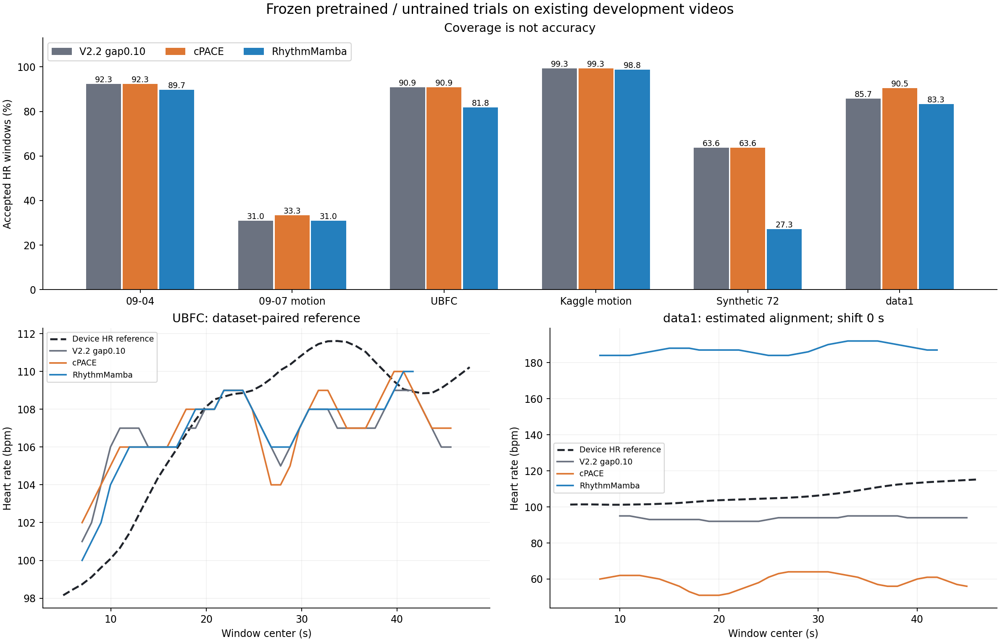

# cPACE 与 RhythmMamba：现有全部视频实测

2026-09-09。两种方法都已实际运行完六个来源视频，并与 V2.1、V2.2 两种缺口设置比较。

**本轮没有得到适合替换现有默认算法的全面升级。** RhythmMamba 在 UBFC 的部分误差指标改善，但覆盖下降；在新拍 data1 上，两种候选都明显退步。现阶段保留现有默认程序，把两者作为可复现的试验分支。

| 主要结果 | 当前 V2.2（0.10 s） | cPACE | RhythmMamba |
|---|---:|---:|---:|
| UBFC 心率 MAE，bpm，越小越好 | 2.56 | 2.54 | 2.20 |
| UBFC 有效心率窗口 | 40/44 | 40/44 | 36/44 |
| UBFC 全参考时段内 ±5 bpm 成功比例 | 81.82% | 81.82% | 81.82% |
| data1 心率 MAE，bpm，越小越好 | 13.18 | 47.68 | 81.43 |
| data1 有效心率窗口 | 36/42 | 38/42 | 35/42 |
| data1 全参考时段内 ±5 bpm 成功比例 | 0% | 0% | 0% |
| 09-07 运动视频有效心率窗口 | 13/42 | 14/42 | 13/42 |

data1 的参考来自 Polar HR 通知，视频开始时间依归档时间估计，并非硬件校准同步。七种固定偏移条件下，cPACE 的 MAE 仍为 45.95–49.63 bpm，RhythmMamba 为 79.48–83.16 bpm。因此，在本次 ±5 s 敏感性范围内，不能把明显退步解释掉。09-07 和 Kaggle 运动视频没有参考心率，不报告准确率。

UBFC 中，V2.2 与 RhythmMamba 的 36 个共同有效窗口，MAE 从 2.59 降到 2.20 bpm，说明局部改善并不完全由删窗造成。但它同时丢失 4 个 V2.2 原有输出，全时段正确窗口数没有增加。相比更早的 V2.1，RhythmMamba 的 UBFC 全时段 ±5 bpm 成功比例还从 88.64% 降到 81.82%。不能仅据较小 MAE 选择新版。



**这次试了什么**

| 方法 | 实际接入 | 依据与边界 |
|---|---|---|
| cPACE | 固定作者源码，不训练；由额头 GREEN 自动估计种子，使用现有三 ROI 颜色序列；主输出固定为额头波形。默认包络校正和预定关闭校正的诊断分支都跑完。 | 2026 年论文与[官方代码](https://github.com/gkaur102/cPACE)、[原文](https://pmc.ncbi.nlm.nih.gov/articles/PMC13372377/)。固定提交 `4cd7a438bf9dd30af8ec3afc365dad53861b6c97`。作者核心心率频带为 0.7–3.0 Hz，包络校正会改变波形形态。 |
| RhythmMamba | 使用唯一固定 PURE 预训练权重；官方模型与 Mamba 类保持原文；以作者参考扫描函数在 RTX 4060 上执行。使用本项目动态人脸框、128×128 RGB、160 帧不重叠片段。 | [AAAI 2025 原文](https://ojs.aaai.org/index.php/AAAI/article/view/33204)、[官方代码](https://github.com/zizheng-guo/RhythmMamba)。固定提交 `1533ad21cb4ae0d31e9dbb9afb0b1eefbed54aed`。动态裁脸、缺口分段、原帧率和项目后处理与作者基准不同，不是完整论文性能或速度复现。 |

两种方法均不读参考来生成输出，不换权重、不按分数挑 ROI、不用参考修正 HR，也不按误差最小值重新对齐。最终心率都从实际保存的波形，以相同 10 s 窗、1 s 步长及现有固定质量条件计算。主表使用离线动态规划读出；局部谱峰、共同窗口、新增/丢失窗口、全部时差方案均保存在 CSV。

**退步现象及下一步方向**

| 已观察到的事实 | 可以得出的判断 | 下一步应验证的方法 |
|---|---|---|
| data1 参考窗口均值为 101.2–115.2 bpm；cPACE 默认输出 51–64 bpm，视频自动种子约 49.13 bpm。 | 该分支明显低估；由视频估计种子并不保证种子对应真实心搏。 | 把颜色投影、种子选择和包络校正分开验证；增加多 ROI / 多候选冲突诊断，避免对错误频段持续窄带跟踪。不能用真实 HR 直接指定种子。 |
| data1 的 RhythmMamba 输出 184–192 bpm，明显高于参考。 | 本次模型适配流程在该片段失败，前处理差异也可能参与其中；周期运动锁频是待验证的候选解释，不能仅凭频率接近确定因果，也不能据此否定 Polar HR。 | 先用视频位移/亮度的同步频谱做无参考冲突标记，并用独立同步视频验证误报抑制；不要把输出强行除以 2 当成修复。 |
| 09-07 的 RhythmMamba 只有 13/42 个 HR 窗；两段短追踪片段不足 160 帧，另有不足整片的尾帧被丢弃。 | 跟踪缺口和分片边界仍限制连续性，换网络没有自动解决这个瓶颈。 | 独立试验带重叠的分片拼接或支持可变长度的推理，检验边缘效应和丢尾；长时间缺脸仍保留无输出。 |
| cPACE 在“没有心搏、只有共同周期亮度变化”的预定合成自检中仍可输出 96 bpm。 | 输出平滑、跨 ROI 一致或谱峰集中，并不能单独证明来自心搏。 | 增加无脉搏负例、周期光照和运动强度阶梯测试，将误报率纳入质量门控验证。 |
| data1 的 RhythmMamba 参考基频 SNR 从 V2.2 的 −13.24 变为 −11.84 dB，但 HR 误差大幅上升。 | 本项目这个 SNR 指标只能辅助诊断，不能代替最终心率误差。 | 同时报 MAE、R5、输出覆盖、连续性；形态恢复要有可靠同步的原始参考波形才能评价。 |

data1 的两种读出也表现不同。RhythmMamba 局部谱峰为 87–192 bpm，而离线动态规划集中到 184–192 bpm；与先前审计的加速度主峰接近，只能支持进一步检查运动混淆，不能确定因果。对应的 MAE 如下，不能把整个错误都归于某一层：

| data1 方法 | 局部谱峰 MAE (bpm) | 离线动态规划 MAE (bpm) |
|---|---:|---:|
| V2.2（0.10 s） | 21.66 | 13.18 |
| cPACE 默认 | 50.10 | 47.68 |
| RhythmMamba | 46.12 | 81.43 |
| cPACE 关闭包络校正（诊断） | 63.91 | 80.48 |

前述改进方向均为下一轮待验证方案，本轮没有实施这些新改动，也没有用当前参考分数反过来调参。现有五段真人录制加一段合成视频适合开发回归；597 个高度重叠窗口不是 597 个独立训练样本，不能证明跨人或跨运动泛化。预训练数据的具体受试者重合也未完成独立审计。

**交付与复现**

指标含义见 [指标口径](指标口径.md)。原始数值见 `evaluation/metrics.csv`、`paired_metrics.csv`、`continuity.csv`、`waveform_metrics.csv` 和 `sensitivity.csv`。每段实际波形、心率、缺失标记均在 `cpace/results/<视频>/` 与 `rhythm/results/<视频>/`，关闭包络校正的完整输出在 `cpace/results_no_homodyne/`。

7 项 cPACE 合成检查、6 项神经后端检查、10 项前处理检查均通过。独立评分还从 18 组新增的保存波形逐值重算了 HR，并复现了 36 条旧基线读出。检查通过说明本轮代码与输出可核对，不代表模型测准了心率。首轮日志类型错误在任何单片结果保存前修复，保留了失败记录；参数和模型数学未因此调整。

原 WSL 项目已新增可选入口 `run_paper_replay.sh`。例如另起一次冻结方案重跑：

```bash
"/home/fengbujue/项目/rppg识别/run_paper_replay.sh" --method both --name experiment_02
```

名称必须唯一，入口会在当前 Windows 工作区建立新目录，拒绝覆盖旧结果。它已通过语法、帮助及仅准备源码快照的烟测；本轮没有再重复整批推理。入口只重跑固定方法，参考评分仍应独立进行。压缩包包含本轮代码、固定权重、表格和结果，不包含原始视频；重新运行依赖原项目视频、V2.2 跟踪缓存及已记录的 WSL 环境。详见工作区根目录 `replay_usage.md`。

下面列出全部视频和两个读出中主读出的完整对比。百分比覆盖率的上涨不等同于波形质量或心率准确率上涨。

## 全部视频的输出覆盖率

每格为“心率有效窗口比例 / 有限波形采样点比例”，单位 %；两者均不是准确率。

| 视频 | V2.1 | V2.2（0.10 s） | V2.2（0.15 s） | cPACE | RhythmMamba |
| --- | --- | --- | --- | --- | --- |
| 09-04 视频 | 92.31 / 92.40 | 92.31 / 92.40 | 92.31 / 92.40 | 92.31 / 93.43 | 89.74 / 91.99 |
| 09-07 运动视频 | 28.57 / 57.80 | 30.95 / 59.73 | 59.52 / 80.92 | 33.33 / 76.04 | 30.95 / 69.88 |
| UBFC subject1 | 90.91 / 92.05 | 90.91 / 92.05 | 90.91 / 92.05 | 90.91 / 93.92 | 81.82 / 87.01 |
| Kaggle 长运动视频 | 77.09 / 92.10 | 99.28 / 99.09 | 99.28 / 99.09 | 99.28 / 99.25 | 98.81 / 98.73 |
| 72 bpm 合成视频 | 63.64 / 80.00 | 63.64 / 80.00 | 63.64 / 80.00 | 63.64 / 84.00 | 27.27 / 64.00 |
| 新拍 data1 | 90.48 / 90.68 | 85.71 / 86.82 | 85.71 / 86.82 | 90.48 / 92.03 | 83.33 / 86.43 |

## UBFC subject1：心率误差

| 方法 | 参考配对窗/全部参考窗 | MAE↓ (bpm) | RMSE↓ (bpm) | Bias (bpm) | 有效输出内 ±5 bpm (%) | 全部参考时段 ±5 bpm (%) |
| --- | --- | --- | --- | --- | --- | --- |
| V2.1 | 40/44 | 2.49 | 2.99 | -0.80 | 97.50 | 88.64 |
| V2.2（0.10 s） | 40/44 | 2.56 | 3.18 | -0.65 | 90.00 | 81.82 |
| V2.2（0.15 s） | 40/44 | 2.56 | 3.18 | -0.65 | 90.00 | 81.82 |
| cPACE | 40/44 | 2.54 | 3.10 | -0.53 | 90.00 | 81.82 |
| RhythmMamba | 36/44 | 2.20 | 2.65 | -0.49 | 100.00 | 81.82 |
| cPACE 关闭包络校正（诊断） | 40/44 | 2.69 | 3.32 | -0.55 | 85.00 | 77.27 |

## 新拍 data1：心率误差

| 方法 | 参考配对窗/全部参考窗 | MAE↓ (bpm) | RMSE↓ (bpm) | Bias (bpm) | 有效输出内 ±5 bpm (%) | 全部参考时段 ±5 bpm (%) |
| --- | --- | --- | --- | --- | --- | --- |
| V2.1 | 38/42 | 13.13 | 13.71 | -13.13 | 0.00 | 0.00 |
| V2.2（0.10 s） | 36/42 | 13.18 | 13.82 | -13.18 | 0.00 | 0.00 |
| V2.2（0.15 s） | 36/42 | 13.18 | 13.82 | -13.18 | 0.00 | 0.00 |
| cPACE | 38/42 | 47.68 | 48.05 | -47.68 | 0.00 | 0.00 |
| RhythmMamba | 35/42 | 81.43 | 81.49 | 81.43 | 0.00 | 0.00 |
| cPACE 关闭包络校正（诊断） | 38/42 | 80.48 | 80.55 | 80.48 | 0.00 | 0.00 |

## 72 bpm 合成视频：心率误差

| 方法 | 参考配对窗/全部参考窗 | MAE↓ (bpm) | RMSE↓ (bpm) | Bias (bpm) | 有效输出内 ±5 bpm (%) | 全部参考时段 ±5 bpm (%) |
| --- | --- | --- | --- | --- | --- | --- |
| V2.1 | 7/11 | 0.00 | 0.00 | 0.00 | 100.00 | 63.64 |
| V2.2（0.10 s） | 7/11 | 0.00 | 0.00 | 0.00 | 100.00 | 63.64 |
| V2.2（0.15 s） | 7/11 | 0.00 | 0.00 | 0.00 | 100.00 | 63.64 |
| cPACE | 7/11 | 0.00 | 0.00 | 0.00 | 100.00 | 63.64 |
| RhythmMamba | 3/11 | 0.00 | 0.00 | 0.00 | 100.00 | 27.27 |
| cPACE 关闭包络校正（诊断） | 7/11 | 0.00 | 0.00 | 0.00 | 100.00 | 63.64 |

## 相同窗口上的比较

分别与 V2.2（0.10 s）取交集，避免丢掉困难窗口后误报进步。新增、丢失窗口的误差另见 paired_metrics.csv。

| 视频 | 候选 | 共同有效窗 | V2.2 MAE | 候选 MAE | 差值↓ (bpm) | 新增窗 | 丢失窗 |
| --- | --- | --- | --- | --- | --- | --- | --- |
| UBFC subject1 | cPACE | 40 | 2.56 | 2.54 | -0.02 | 0 | 0 |
| UBFC subject1 | RhythmMamba | 36 | 2.59 | 2.20 | -0.39 | 0 | 4 |
| 新拍 data1 | cPACE | 36 | 13.18 | 48.07 | 34.89 | 2 | 0 |
| 新拍 data1 | RhythmMamba | 33 | 12.50 | 81.35 | 68.84 | 2 | 3 |
| 72 bpm 合成视频 | cPACE | 7 | 0.00 | 0.00 | 0.00 | 0 | 0 |
| 72 bpm 合成视频 | RhythmMamba | 3 | 0.00 | 0.00 | 0.00 | 0 | 4 |

## 连续性：最长连续输出窗口的原视频支撑区间

单位秒。这里计算重叠窗口覆盖区间的并集，包含窗口本身时长；不能把它理解为逐秒心率输出持续了同样久。

| 视频 | V2.1：秒 / 内部断点 | V2.2（0.10 s）：秒 / 内部断点 | V2.2（0.15 s）：秒 / 内部断点 | cPACE：秒 / 内部断点 | RhythmMamba：秒 / 内部断点 |
| --- | --- | --- | --- | --- | --- |
| 09-04 视频 | 45.00 / 0 | 45.00 / 0 | 45.00 / 0 | 45.00 / 0 | 44.00 / 0 |
| 09-07 运动视频 | 19.00 / 1 | 19.00 / 1 | 21.00 / 3 | 19.00 / 1 | 19.00 / 1 |
| UBFC subject1 | 48.66 / 0 | 48.66 / 0 | 48.66 / 0 | 48.66 / 0 | 44.70 / 0 |
| Kaggle 长运动视频 | 114.11 / 7 | 425.43 / 0 | 425.43 / 0 | 425.43 / 0 | 423.42 / 0 |
| 72 bpm 合成视频 | 16.00 / 0 | 16.00 / 0 | 16.00 / 0 | 16.00 / 0 | 12.00 / 0 |
| 新拍 data1 | 47.00 / 0 | 45.00 / 0 | 45.00 / 0 | 47.00 / 0 | 44.00 / 0 |

## 波形参考基频 SNR

单位 dB，各自有效参考窗口的均值。滤波带宽和有效窗口不同，因此只能作为辅助诊断；不是形态相关性或波形正确率。

| 视频 | V2.1 | V2.2（0.10 s） | V2.2（0.15 s） | cPACE | RhythmMamba | cPACE 关闭包络校正（诊断） |
| --- | --- | --- | --- | --- | --- | --- |
| UBFC subject1 | -3.72 (n=40) | 1.45 (n=40) | 1.45 (n=40) | 2.97 (n=40) | 4.07 (n=36) | -1.90 (n=40) |
| 新拍 data1 | -13.38 (n=38) | -13.24 (n=36) | -13.24 (n=36) | -44.69 (n=38) | -11.84 (n=35) | -13.78 (n=38) |
| 72 bpm 合成视频 | 9.35 (n=7) | 9.75 (n=7) | 9.75 (n=7) | 10.25 (n=7) | 6.64 (n=3) | 10.28 (n=7) |

## data1 时间对齐敏感性

固定主结果为偏移 0 s；表中偏移是相对于估计的视频开始 UTC 时间追加的秒数。列出全部方案，不选择误差最小的偏移。

| 偏移 (s) | V2.2（0.10 s）：MAE / 全时段±5% | cPACE：MAE / 全时段±5% | RhythmMamba：MAE / 全时段±5% |
| --- | --- | --- | --- |
| -5 | 11.38 / 0.00 | 45.95 / 0.00 | 83.16 / 0.00 |
| -2 | 12.43 / 0.00 | 46.98 / 0.00 | 82.14 / 0.00 |
| -1 | 12.80 / 0.00 | 47.33 / 0.00 | 81.79 / 0.00 |
| 0 | 13.18 / 0.00 | 47.68 / 0.00 | 81.43 / 0.00 |
| 1 | 13.57 / 0.00 | 48.05 / 0.00 | 81.05 / 0.00 |
| 2 | 13.96 / 0.00 | 48.43 / 0.00 | 80.67 / 0.00 |
| 5 | 15.21 / 0.00 | 49.63 / 0.00 | 79.48 / 0.00 |
