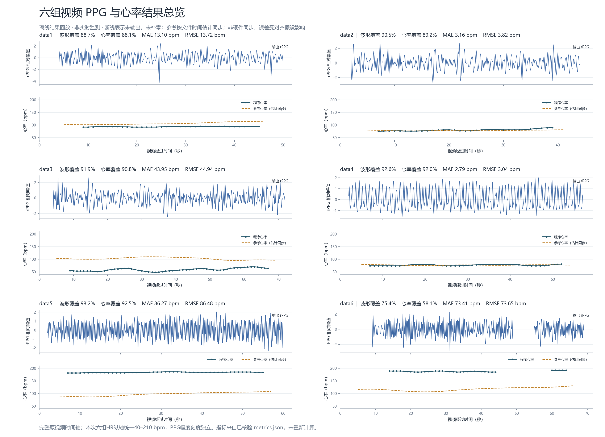

# 六组视频 PPG 与心率对照报告

本次将桌面“视频”目录内 data1.zip 至 data6.zip 全部使用项目已经安装的 V2.4 实验入口重新分析。data1 复跑重现之前的主要结果。原视频和旧结果保留，11 个推断源码文件哈希在运行前后一致；本轮未修改核心算法或调整其阈值。

**结论：目前程序在 data2、data4 上较准确，在 data1、data3、data5、data6 上误差明显。连续输出波形或心率，不等于测量准确。以下误差均以文件时间估计同步为前提，尚非硬件同步验证。**

## 1. 直接查看六组结果

每个 MP4 同屏显示原视频、保存的 rPPG 波形、程序心率、Polar 参考心率和时间指针；它是完整时长的离线结果回放。显示视频为 1280×720、15 fps、H.264；这只改变展示规格，推断仍使用每段原视频的完整帧数和原帧率。波形和心率没有额外平滑或补零。

| 视频 | 动态回放 | PPG / 心率静态图 | 逐窗参考对照 |
|---|---|---|---|
| data1 | [播放 MP4](data1/presentation/result_video.mp4) | [查看 PNG](data1/presentation/ppg_hr.png) / [SVG](data1/presentation/ppg_hr.svg) | [CSV](data1/evaluation/paired_windows.csv) |
| data2 | [播放 MP4](data2/presentation/result_video.mp4) | [查看 PNG](data2/presentation/ppg_hr.png) / [SVG](data2/presentation/ppg_hr.svg) | [CSV](data2/evaluation/paired_windows.csv) |
| data3 | [播放 MP4](data3/presentation/result_video.mp4) | [查看 PNG](data3/presentation/ppg_hr.png) / [SVG](data3/presentation/ppg_hr.svg) | [CSV](data3/evaluation/paired_windows.csv) |
| data4 | [播放 MP4](data4/presentation/result_video.mp4) | [查看 PNG](data4/presentation/ppg_hr.png) / [SVG](data4/presentation/ppg_hr.svg) | [CSV](data4/evaluation/paired_windows.csv) |
| data5 | [播放 MP4](data5/presentation/result_video.mp4) | [查看 PNG](data5/presentation/ppg_hr.png) / [SVG](data5/presentation/ppg_hr.svg) | [CSV](data5/evaluation/paired_windows.csv) |
| data6 | [播放 MP4](data6/presentation/result_video.mp4) | [查看 PNG](data6/presentation/ppg_hr.png) / [SVG](data6/presentation/ppg_hr.svg) | [CSV](data6/evaluation/paired_windows.csv) |

[六组波形与心率总览](presentation/all_six_ppg_hr.png)

## 2. 核心指标对比

| 视频 | PPG 波形覆盖率 | 心率输出 / 计划窗 | 心率覆盖率 | MAE（bpm） | RMSE（bpm） | 已输出结果 ±5 bpm 占比 | 全参考窗口成功率 |
|---|---:|---:|---:|---:|---:|---:|---:|
| data1 | 88.75% | 37/42 | 88.10% | 13.10 | 13.72 | 0.00% | 0.00% |
| data2 | 90.45% | 33/37 | 89.19% | 3.16 | 3.82 | 87.88% | 78.38% |
| data3 | 91.85% | 59/65 | 90.77% | 43.95 | 44.94 | 0.00% | 0.00% |
| data4 | 92.58% | 46/50 | 92.00% | 2.79 | 3.04 | 100.00% | 92.00% |
| data5 | 93.25% | 49/53 | 92.45% | 86.27 | 86.48 | 0.00% | 0.00% |
| data6 | 75.42% | 36/62 | 58.06% | 73.41 | 73.65 | 0.00% | 0.00% |

指标含义：

- **PPG 波形覆盖率**：保存波形中存在有效数值的帧数 / 全部解码帧数。它不等于与接触式 PPG 波形的形态一致率。
- **心率覆盖率**：程序接受并输出心率的窗口数 / 所有计划窗口数。各窗 10 秒、步长约 1 秒，彼此重叠，不能把窗口数乘 10 当成覆盖时长。
- **MAE / RMSE**：仅在程序有效输出且参考合格的相同窗口上计算；单位是次/分钟，越小越好。
- **已输出结果 ±5 bpm 占比（P5）**：误差不超过 5 bpm 的窗口数 / 有效配对窗口数。这里的 0% 表示已输出的心率全部超出该误差门限，绝不是心率值为零或完全没有输出。
- **全参考窗口成功率（R5）**：误差不超过 5 bpm 的窗口数 / 所有参考合格的计划窗口数。缺失输出也留在分母，避免只挑容易时段报告准确率。

合并六段的描述性结果：309 个计划窗口，260 个有效配对输出，75 个在 ±5 bpm 内；配对输出 P5=28.85%，全参考窗口 R5=24.27%，按配对窗口加权 MAE=39.16 bpm。这些窗口重叠、录制可能包含重复受试者，不能把该结果解释成独立人群的泛化准确率。

[完整指标 CSV](comparison_metrics.csv) · [指标 JSON](comparison_metrics.json)

## 3. 预测到底偏到哪里

| 视频 | 同窗程序均值（bpm） | 同窗参考均值（bpm） | 程序输出范围（bpm） | 主要现象 |
|---|---:|---:|---|---|
| data1 | 93.62 | 106.72 | 92–95 | 持续偏低；复现旧结果 |
| data2 | 80.24 | 78.90 | 75–90 | 多数窗口接近参考 |
| data3 | 58.68 | 102.63 | 48–70 | 明显偏低，不能用高覆盖率代表准确 |
| data4 | 76.61 | 76.94 | 74–81 | 本组配对窗口全部在 ±5 bpm 内 |
| data5 | 183.67 | 97.40 | 181–186 | 持续偏高，形成错误的稳定轨迹 |
| data6 | 187.67 | 114.25 | 185–192 | 持续偏高，并有内部缺口 |

## 4. 输入规格与连续性

| 视频 | 原分辨率 | 原帧率 | 完整解码帧数 | 时长（秒） | 人脸检出率 | RGB 可用率 | 最长连续波形（秒） | 心率内部断点 |
|---|---|---:|---:|---:|---:|---:|---:|---:|
| data1 | 3840×2160 | 30.000030 | 1555 | 51.83 | 90.16% | 97.36% | 46.00 | 0 |
| data2 | 3840×2160 | 30.000030 | 1393 | 46.43 | 100.00% | 100.00% | 42.00 | 0 |
| data3 | 3840×2160 | 30.000030 | 2221 | 74.03 | 100.00% | 100.00% | 68.00 | 0 |
| data4 | 1280×720 | 180.001800 | 10693 | 59.40 | 100.00% | 100.00% | 55.00 | 0 |
| data5 | 3840×2160 | 30.000030 | 1866 | 62.20 | 100.00% | 100.00% | 58.00 | 0 |
| data6 | 3840×2160 | 30.000030 | 2148 | 71.60 | 89.11% | 90.55% | 40.00 | 1 |

data4 的 AVI 两处头信息曾分别声明 10702 与 10693 帧。独立顺序解码与 ffprobe 全帧计数均确认 **10693 帧、59.4049615 秒**，本次按真实解码结果处理。不能由 data4 误差较低推断“180 fps 一定比 30 fps 准确”：不同录像的人物、动作、时段、分辨率均未控制。

data1–5 最终拒绝窗全部标为 gap_or_filter_edge，且内部心率断点为 0；data6 有 26 个此类拒绝窗，内部断点为 1。该状态合并了原始缺失与滤波/拼接边界，不能把它全部解释为人脸丢失。data3/5 人脸检出和 RGB 可用均为 100%，却仍严重误估，说明瓶颈涉及后续信号与频率判别。

原始画面的抽样联系表显示 data2/3/4 的三个抽样时刻为坐姿、脸部较清晰，data1/5/6 有位置变化及模糊；抽样画面不代表整段连续动作标注。[原视频抽样联系表](reference_audit/source_contact_sheet.jpg) · [完整帧数校验](reference_audit/video_metadata_audit.json)

## 5. 参考数据和同步限制

主参考是用户提供的 Polar 设备 hr_bpm，时间使用整数 host_utc_ns。它是设备心率，不能写成 ECG 真值。六组都有 PPG/ACC 原始记录，18 条流的样本索引、时间顺序及有限数值均通过检查；PPG 的 device_time_ns 是采集软件重建时间，尚不能据此声称与相机实现逐搏同步。

本次沿用既有独立时间规则：**视频在 ZIP 内的原始 Unix 修改时间 − 完整解码时长**，估计视频开始时间；每个分析窗取同时间段的正值、有限参考心率均值。要求参考覆盖窗口、至少 2 条记录且包括边界在内无超过 2 秒缺口。没有把录像与参考各自起点归零，也没有寻找让模型误差最小的时间偏移。

data2 文件名中的起始时间与上述规则相差约 0.186 秒，可作为间接佐证，不能替代共享同步标记。data4 的参考会话比录像长，已按视频对应时间截取。六组主偏移下参考窗口均全部合格。

| 视频 | 主对齐 MAE（bpm） | 预定七个偏移下 MAE 范围（bpm） | 同步敏感性明细 |
|---|---:|---:|---|
| data1 | 13.10 | 11.33–15.09 | [CSV](data1/evaluation/alignment_sensitivity.csv) |
| data2 | 3.16 | 2.72–3.16 | [CSV](data2/evaluation/alignment_sensitivity.csv) |
| data3 | 43.95 | 43.60–44.44 | [CSV](data3/evaluation/alignment_sensitivity.csv) |
| data4 | 2.79 | 2.16–2.79 | [CSV](data4/evaluation/alignment_sensitivity.csv) |
| data5 | 86.27 | 84.21–87.93 | [CSV](data5/evaluation/alignment_sensitivity.csv) |
| data6 | 73.41 | 71.31–74.35 | [CSV](data6/evaluation/alignment_sensitivity.csv) |

七个偏移固定为 −5、−2、−1、0、1、2、5 秒。上表范围只表示这些预定假设下的敏感性，不是置信区间、同步误差边界或对齐优化结果；各行的有效参考窗口数保存在 CSV。data3/5/6 的大误差在这些偏移下仍存在，几秒时间平移不能解释这些偏差。

## 6. 优化正确率：优先改哪三处

| 优先项 | 本批证据 | 建议修改的代码位置与方法 | 验证要求 |
|---|---|---|---|
| 1. 更可靠地区分脉动与运动频率 | data1/5/6 部分具备完整运动参考的窗口，错误输出频率与运动谱强峰重叠；data4 的准确窗口也可能有归一化运动谱重叠 | motion_fusion.py、waveform_hr.py：将绝对运动幅度、运动参考可靠性及频谱重叠联合评分；位移按秒归一化以兼容 30/180 fps；保留跟踪、局部筛选与失败回退 | 不能仅按归一化运动谱高就剔除，否则可能误伤 data4；同时比较 MAE、P5 和 R5 |
| 2. 保留多候选，允许摆脱错误轨迹 | data5/6 产生稳定的约 184/188 bpm 轨迹；但 data2 的 DP 显著优于局部最大峰 | waveform_hr.py、legacy_motion.py：保留多个有信号证据的候选，联合评估基频/谐波、时域周期与颜色证据；证据冲突时允许重新获取或输出未知状态 | 不可删除全部 DP 平滑，也不可统一把心率乘二或除二；当前错误并非全是严格倍频 |
| 3. 用证据决定分支并校准质量评分 | data3 一些分歧窗的跟踪候选更接近参考，data1/6 的分歧窗却多为原分支更接近；两分支都可能稳定错误 | guarded_fusion.py：改进“分歧超过12 bpm默认保留原分支”的判据；联合跟踪可靠性、实际运动幅度、脉动证据与多候选一致性，保留拒绝/重获通道 | 不可一律改选 tracked；不得用参考心率在线选分支。用按受试者或独立录制划分的新数据验证 |

这些是本批证据支持的改进方向，尚未实现为新算法，也没有声称优化后准确率已提高。仅通过拒绝错误窗口可以让条件 MAE 看起来下降，但不会自动提高全参考窗口成功率 R5；下一轮应把 R5 与误差一起作为验收指标，并为 data2/4 设置性能回退检查。

data6 的额外连续性问题可在上述准确性改进后处理：先按帧源和质量原因定位丢失段，再改善有效皮肤区域获取和重获；不能靠插值长缺口或沿用上一心率制造覆盖率。

[逐窗口频率诊断](qa/frequency_diagnosis_windows.csv) · [诊断汇总](qa/frequency_diagnosis.json)

## 7. 运行与验证记录

- 全部六段完整运行：tracking_screened、guarded_fusion、max_gap=0.10 秒、10 秒窗、约 1 秒步长、42–210 bpm。参考不传入推断。
- 独立 QA 对六段的 POS/CHROM/fusion 共 18 条保存波形回算局部频谱与离线 DP 心率，并检查覆盖、拒绝行、时间轴、ROI 来源和冻结参数；全部通过。QA 证明结果与处理规则一致，不等于已证明生理测量准确。
- 六组源视频均独立顺序解码，原始压缩包在解压读取时进行 CRC 完整性检查；视频 SHA-256 与原始 ZIP 成员信息保存在输入清单。
- 每组动态图的编码、全程解码、帧数、时长和源结果未改动检查保存在 presentation/render_manifest.json。

[输入清单](inputs_manifest.json) · [冻结推断配置](protocol_before_inference.json) · [评价定义](evaluation_protocol.json) · [运行记录](runs.json) · [独立 QA](qa/waveform_replay_qa.json)

补充字段 reference_frequency_snr_db 只是波形在参考心率频带的能量相对其他频带的比值；不是接触式波形形态验证，也不直接与旧报告的不同去均值口径 SNR 比较。本次没有给出未经逐搏同步验证的波形相关系数或波形形态准确率。

所有主要交付均在项目 results/data1_6_20260911 内；新增批处理/评价/回放脚本在项目 batch_analysis_20260911 内。
