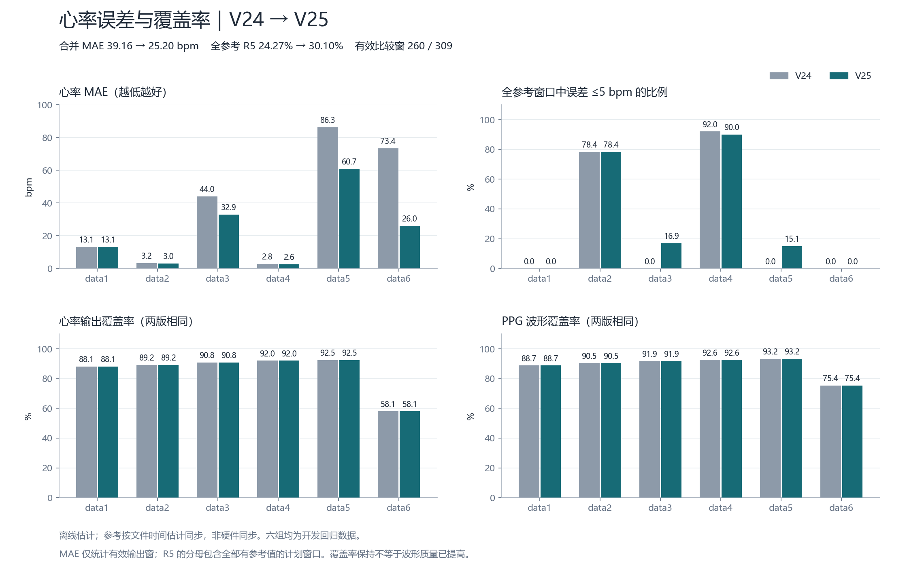
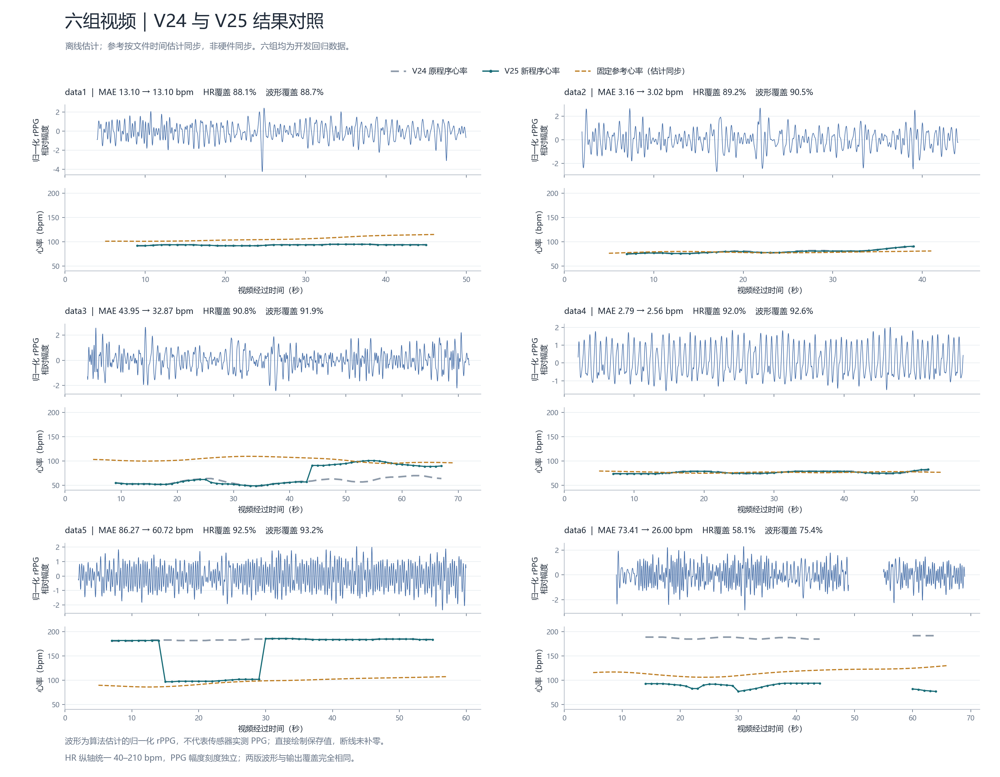

# V2.5 代码优化与六视频指标变化

**已按运动频率判别、多候选心率与重获、分支选择的顺序修改并验证。推荐版采用新心率判断，保留原来的实际波形融合与分支选择；新融合和新路由仍可单独实验。**

六组有效配对窗口的合并 MAE：**39.16 → 25.20 bpm（降低 35.64%）**；全参考窗口 ±5 bpm 成功率 R5：**24.27% → 30.10%（+5.83 个百分点）**。PPG 波形覆盖和 HR 输出覆盖保持不变，逐样本波形在数值精度内一致（复算容差 1e-8）。

**这不是所有指标都提高：data1 心率没有改善，data4 的 ±5 bpm 窗口从 46 降为 45，data3/5/6 仍不够准确。当前六段是开发录像；参考仅为估计时间同步的 Polar 设备心率，不能据此宣布独立人群、实时运动或临床精度已达标。**

## 1. 每个视频实际变化

表中箭头为 V2.4 → V2.5 推荐版；MAE/RMSE 越小越好，P5/R5 越大越好。

| 视频 | MAE（bpm） | RMSE（bpm） | 已输出配对 P5 | 全参考窗口 R5 |
|---|---:|---:|---:|---:|
| data1 | 13.10 → 13.10 | 13.72 → 13.72 | 0.00 → 0.00% | 0.00 → 0.00% |
| data2 | 3.16 → 3.02 | 3.82 → 3.81 | 87.88 → 87.88% | 78.38 → 78.38% |
| data3 | 43.95 → 32.87 | 44.94 → 39.72 | 0.00 → 18.64% | 0.00 → 16.92% |
| data4 | 2.79 → 2.56 | 3.04 → 2.89 | 100.00 → 97.83% | 92.00 → 90.00% |
| data5 | 86.27 → 60.72 | 86.48 → 70.92 | 0.00 → 16.33% | 0.00 → 15.09% |
| data6 | 73.41 → 26.00 | 73.65 → 27.78 | 0.00 → 0.00% | 0.00 → 0.00% |

| 视频 | 波形覆盖率（前后相同） | HR 覆盖率（前后相同） | 输出/计划窗（前后相同） | ±5 bpm 窗数 |
|---|---:|---:|---:|---:|
| data1 | 88.75% | 88.10% | 37/42 | 0 → 0 |
| data2 | 90.45% | 89.19% | 33/37 | 29 → 29 |
| data3 | 91.85% | 90.77% | 59/65 | 0 → 11 |
| data4 | 92.58% | 92.00% | 46/50 | 46 → 45 |
| data5 | 93.25% | 92.45% | 49/53 | 0 → 8 |
| data6 | 75.42% | 58.06% | 36/62 | 0 → 0 |

合并结果：309 个计划/合格参考窗口，260 个有效配对输出，±5 bpm 窗数 75 → 93；P5 28.85% → 35.77%；合并 RMSE 51.47 → 37.99 bpm。新旧是相同的 260 个窗口，因此推荐版的 MAE 降低不是丢掉困难时段造成的。



## 2. 指标最简解释

| 指标 | 含义 |
|---|---|
| 波形覆盖率 | 有有限 rPPG 数值的帧数 / 全部帧数，反映可输出程度，不是波形正确率 |
| HR 覆盖率 | 有效心率输出窗 / 所有计划窗 |
| MAE | 心率与同窗参考的平均绝对误差，单位 bpm |
| RMSE | 误差平方均值开根，更敏感于大误差，单位 bpm |
| P5 | 误差 ≤5 bpm 的窗 / 有效配对输出窗 |
| R5 | 误差 ≤5 bpm 的窗 / 全部参考合格计划窗，缺失输出也留在分母 |

10 秒窗口约每秒移动一次，窗口互相重叠；不能把窗数乘 10 当成有效秒数。0% 的 P5/R5 表示未进入 ±5 bpm，绝不是 HR 为 0。NaN 表示没有有效输出，图上断线；没有用 0、上一心率或插值填补。

人脸检出、RGB 可用、波形数值及其覆盖、最长连续波形段等前端/波形指标全部保留。本轮没有改进波形本体，因此不能声称波形相关系数、形态保真、SNR 或抗伪影能量得到提升；没有计算接触 PPG 形态对齐相关系数。HR 精度改善与波形质量改善是不同结论。

## 3. 三步逐次验证及最终选择

| 实验 | 合并 MAE（bpm） | R5 | HR 覆盖 | 采用门槛 |
|---|---:|---:|---:|---|
| [V24 原版回放](v24_replay/stage_metrics.csv) | 39.16 | 24.27% | 84.14% | 对照 |
| [① 运动证据进入融合](stage1_motion/stage_metrics.csv) | 38.58 | 24.27% | 82.85% | 未通过 |
| [② 加上多候选 HR](stage2_hr/stage_metrics.csv) | 18.52 | 35.28% | 82.85% | 未通过 |
| [③ 再加新分支选择](stage3_routing/stage_metrics.csv) | 18.68 | 33.98% | 78.96% | 未通过 |
| [采用：保留原波形 + 新 HR](stage4_preserve_waveform/stage_metrics.csv) | 25.20 | 30.10% | 84.14% | 通过 |

① 运动证据引入可用性、绝对运动幅度和连续段频谱，避免只看归一化谱峰。它进入融合候选选择后，data6 波形覆盖从 75.42% 降到 55.87%，HR 覆盖从 58.06% 降到 50.00%。独立诊断确认：逐帧轨迹及 ROI 波形文件未变；尾段候选从约 191–192 bpm 转到约 95–97 bpm，但通过相关性门槛的实际贡献 ROI 只剩一个，达不到两个 ROI 的原规则。因而丢失尾段 14 秒波形和 5 个 HR 窗，并非像素跟踪突然失败。

② 多候选 HR 引入真实谱峰能量、周期、自相关、实际谐波支持及软运动扣分；带有代价的 DP 重获减少错误轨迹持续锁定。它在同一波形上降低本批合并 HR 误差，但继承步骤①的覆盖损失。

③ 新分支路由在大频率分歧时比较证据，允许未决。它继续减少部分输出，未通过覆盖门槛，暂不默认启用。

最后增加保留原波形的受控消融：恢复原融合/路由，仅保留新 HR 判断（HR 内部依然使用可靠运动证据）。没有修改算法评分常数、没有按视频编号选参、没有用参考值选频。这是看到前三步结果后的开发选择，不能称为事先注册的独立试验。

采用门槛在初次候选运行前记录：合并 MAE 至少降 10%、R5 至少增 5 个百分点；任一录像 MAE 增量不超过 5 bpm；保护 data2/data4 的 MAE 增量不超过 1 bpm、R5 下降不超过 5 个百分点；任一录像 HR 和波形覆盖下降不超过 5 个百分点；共同窗口 MAE 降低。推荐版通过全部门槛。门槛是本项目开发规则，不是行业/竞赛标准。

[最初协议及源码冻结](protocol_before_validation.json) · [追加消融协议](stage4_preserve_waveform/protocol_before_run.json) · [推荐版验收细节](stage4_preserve_waveform/stage_evaluation.json)

## 4. 查看程序实际输出

| 视频 | PPG 与心率折线图 | 波形 CSV | 最终 HR 与全部候选 | 与参考逐窗比较 |
|---|---|---|---|---|
| data1 | [PNG](stage4_preserve_waveform/data1/presentation/ppg_hr.png) / [SVG](stage4_preserve_waveform/data1/presentation/ppg_hr.svg) | [CSV](stage4_preserve_waveform/data1/fusion_waveform.csv) | [CSV](stage4_preserve_waveform/data1/fusion_heart_rate.csv) | [CSV](stage4_preserve_waveform/data1/evaluation/paired_windows.csv) |
| data2 | [PNG](stage4_preserve_waveform/data2/presentation/ppg_hr.png) / [SVG](stage4_preserve_waveform/data2/presentation/ppg_hr.svg) | [CSV](stage4_preserve_waveform/data2/fusion_waveform.csv) | [CSV](stage4_preserve_waveform/data2/fusion_heart_rate.csv) | [CSV](stage4_preserve_waveform/data2/evaluation/paired_windows.csv) |
| data3 | [PNG](stage4_preserve_waveform/data3/presentation/ppg_hr.png) / [SVG](stage4_preserve_waveform/data3/presentation/ppg_hr.svg) | [CSV](stage4_preserve_waveform/data3/fusion_waveform.csv) | [CSV](stage4_preserve_waveform/data3/fusion_heart_rate.csv) | [CSV](stage4_preserve_waveform/data3/evaluation/paired_windows.csv) |
| data4 | [PNG](stage4_preserve_waveform/data4/presentation/ppg_hr.png) / [SVG](stage4_preserve_waveform/data4/presentation/ppg_hr.svg) | [CSV](stage4_preserve_waveform/data4/fusion_waveform.csv) | [CSV](stage4_preserve_waveform/data4/fusion_heart_rate.csv) | [CSV](stage4_preserve_waveform/data4/evaluation/paired_windows.csv) |
| data5 | [PNG](stage4_preserve_waveform/data5/presentation/ppg_hr.png) / [SVG](stage4_preserve_waveform/data5/presentation/ppg_hr.svg) | [CSV](stage4_preserve_waveform/data5/fusion_waveform.csv) | [CSV](stage4_preserve_waveform/data5/fusion_heart_rate.csv) | [CSV](stage4_preserve_waveform/data5/evaluation/paired_windows.csv) |
| data6 | [PNG](stage4_preserve_waveform/data6/presentation/ppg_hr.png) / [SVG](stage4_preserve_waveform/data6/presentation/ppg_hr.svg) | [CSV](stage4_preserve_waveform/data6/fusion_waveform.csv) | [CSV](stage4_preserve_waveform/data6/fusion_heart_rate.csv) | [CSV](stage4_preserve_waveform/data6/evaluation/paired_windows.csv) |



推荐版波形就是 V2.4 实际波形，新版只更改如何从它判断心率。`ridge_bpm` 是最终 HR；`evidence_local_bpm` 是新评分局部首选；`raw_spectral_peak_bpm` 是最大功率峰；`consensus_bpm` 是 ROI 提议。它们用途不同，不能把提议的改善当作最终输出改善。

## 5. 比较是否可信

- 同一六段、同一完整帧时间轴、同一 10 秒窗/约 1 秒步长、同一 42–210 bpm 范围、同一 0.10 秒短缺帧规则。前端无改动，读取验证过的完整原视频采样缓存；本轮重新运行全部波形与 HR 后端，而非重新解码视频。
- 新增及既有合成/回归测试共 132 项通过；关闭三个开关时，六组核心输出逐值重现 V2.4。推荐版逐样本波形在 1e-8 数值容差内一致，覆盖及接受窗掩码完全相同。独立审计另核验保存波形的候选功率、DP 输出支撑、缺失及评分。代码正确运行不等于生理测量准确。
- 推理没有传参考数据；对照在输出后进行。主参考采用原 Polar 心率合格窗口；视频起点仍为 ZIP 原始 Unix 修改时间减完整视频时长。没有以模型最小误差选起点。
- 参考不是 ECG 真值；没有共享相机/设备同步标记。以下七个固定偏移全部报告，不挑最好成绩。
- 这些录像已经用于定位问题和选择开发配置，窗口相互重叠且可能包含重复受试者；本报告是开发回归，不能作为独立人群泛化成绩，也不报告虚假的显著性。
- 完整链路为离线处理，包含未来窗口信息。新参数来自合成反例和工程设计，并非复现某篇最新论文的预训练权重。

| 视频 | 推荐版主对齐 MAE | 固定 −5/−2/−1/0/+1/+2/+5 秒下 MAE 范围 |
|---|---:|---:|
| data1 | 13.10 | 11.33–15.09 |
| data2 | 3.02 | 2.55–3.02 |
| data3 | 32.87 | 32.69–32.90 |
| data4 | 2.56 | 2.08–2.56 |
| data5 | 60.72 | 58.66–62.38 |
| data6 | 26.00 | 25.07–28.10 |

[独立指标与协议审计](qa_protocol_integrity_final.json) · [保存波形与 HR 证据审计](qa_v25_evidence.json)

独立审计共复核 30 组阶段/视频指标及 210 行同步敏感性，并从保存波形复核 18 组新 HR 输出。推荐版与本轮 V24 回放逐数值一致；与历史 V24 融合波形最大绝对差为 1.08e-13（CSV 数值舍入量级），覆盖和接受掩码完全相同。实验步骤③的 data5 有两个窗口存在相差 1 bpm 的同分最优路径，保存候选的 DP 可精确重放；推荐版没有该差异。详见审计凭据。

原始冻结清单已记录推理源码、主配对参考、采样缓存及运行/评价脚本哈希。独立审计补充记录 alignment、原始参考及参考核心脚本哈希；这些补充项是在运行后记录，不能称为事前冻结。

## 6. 代码位置与运行

代码在项目的 `motion_upgrade_v25_20260911/`；入口为 `run_motion_v25.sh`。

```bash
cd /home/fengbujue/项目/rppg识别
./run_motion_v25.sh videos/your_video.avi --output results/your_video_v25
```

全部新融合/路由的实验入口是 `run_motion_v25_all_experimental.sh`；它在本批覆盖较差，不作为推荐配置。V2.4、原默认 `run.sh`、旧结果和原视频保留。

[完整运行说明](../../motion_upgrade_v25_20260911/README.md) · [全部阶段汇总 CSV](all_stages_metrics.csv) · [可转发结果包](V25六视频结果与对比.zip)

## 7. 下一步优化顺序

先补齐相机与 Polar 的共享同步标记及未参与本轮选择的新录像，再固定新配置评估；优先处理 data1 持续偏低、data3 错误低频、data5/6 高频干扰。算法下一步应增加能保留脉动的多 ROI 波形证据和照明/非刚性运动区分，而不是降低输出门槛来制造更高覆盖率。实际目标仍是精度与连续性共同改善，本轮只实现了 HR 精度改善和原覆盖保留。
