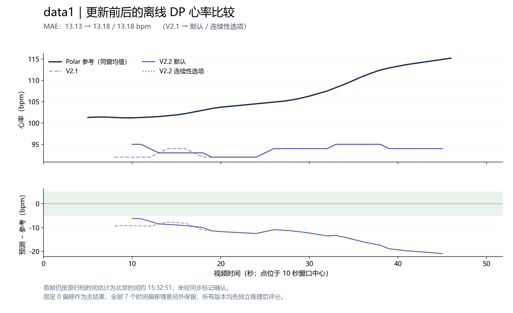

# rPPG V2.2：全部现有视频的优化验证与研究路线

本轮已经完成代码更新、6个采集来源的12次视频运行及57项测试。下面结果来自实际程序输出；这是曾经观察过的开发与回归资料，不是新增独立测试集。

**新拍 data1 的融合心率 MAE：V2.1 为 13.13 bpm，V2.2 默认为 13.18 bpm，连续性选项为 13.18 bpm。** 三个结果沿用同一个归档时间对齐假设，不能称为已验证的精确同步。

本轮可确认的收益是部分运动视频的输出连续性；有参考的真人片段没有显示整体HR准确度提升。V2.2保留为可选实验入口，原V2.1继续保留。尤其data1减少了输出窗口，不能用少数共同窗的轻微误差改善掩盖整段结果。

data1的局部频谱峰MAE还从13.29上升至21.66 bpm，说明单次频谱读出退步明显；离线DP减轻了这一退步，但没有解决参考心率偏低估计问题。该版本不能直接描述为精度升级。

## 1. 所有视频的指标变化

心率输出率是有效输出窗/全部计划窗。MAE 单位为 bpm，越低越好；无参考的视频没有可计算的准确度。

| 视频 | 参考条件 | V2.1 心率输出率 | V2.2 默认 | V2.2 连续性选项 | MAE：旧 → 默认 → 连续性 |
|---|---|---:|---:|---:|---|
| 9月4日视频 | 无参考 | 92.31% | 92.31% | 92.31% | — → — → — |
| 9月7日运动视频 | 无参考 | 28.57% | 30.95% | 59.52% | — → — → — |
| UBFC subject1 | 配套同步参考 | 90.91% | 90.91% | 90.91% | 2.49 → 2.56 → 2.56 |
| Kaggle 运动原片 | 无参考 | 77.09% | 99.28% | 99.28% | — → — → — |
| 合成72 bpm | 已知合成频率 | 63.64% | 63.64% | 63.64% | 0.00 → 0.00 → 0.00 |
| 新拍 data1 | 估计同步参考 | 90.48% | 85.71% | 85.71% | 13.13 → 13.18 → 13.18 |

| 视频 | V2.1 波形覆盖率 | V2.2 默认 | V2.2 连续性选项 | 最长连续心率窗数：旧 → 默认 → 连续性 |
|---|---:|---:|---:|---|
| 9月4日视频 | 92.40% | 92.40% | 92.40% | 36 → 36 → 36 |
| 9月7日运动视频 | 57.80% | 59.73% | 80.92% | 10 → 10 → 12 |
| UBFC subject1 | 92.05% | 92.05% | 92.05% | 40 → 40 → 40 |
| Kaggle 运动原片 | 92.10% | 99.09% | 99.09% | 105 → 416 → 416 |
| 合成72 bpm | 80.00% | 80.00% | 80.00% | 7 → 7 → 7 |
| 新拍 data1 | 90.68% | 86.82% | 86.82% | 38 → 36 → 36 |

连续窗数不是独立样本数。10秒窗约每秒滑动一次，不能将连续窗数乘10当成有效监测时长。详细表同时保留中心时间跨度、原视频支持区间并集、内部断点和最大拒绝窗段。

9月7日运动片在0.15秒选项下输出增多，但最长连续HR窗口对应的原视频支持区间仅从约19秒增至21秒，内部断点从1个增至3个，新增输出仍较零散。Kaggle原片的对应最长支持区间则从114.11秒增至425.43秒，内部断点从7个降至0；其真实心率是否准确仍因缺少参考而未知。

## 2. 有参考片段的误差与命中率

| 视频 / 版本 | 比较窗 / 参考窗 | MAE↓ | RMSE↓ | Bias | P5↑ | R5↑ |
|---|---:|---:|---:|---:|---:|---:|
| UBFC subject1 / V2.1 / 离线DP | 40/44 | 2.49 | 2.99 | -0.80 | 97.50% | 88.64% |
| UBFC subject1 / V2.1 / 局部峰 | 40/44 | 2.64 | 3.39 | -0.95 | 75.00% | 68.18% |
| UBFC subject1 / V2.2 默认 / 离线DP | 40/44 | 2.56 | 3.18 | -0.65 | 90.00% | 81.82% |
| UBFC subject1 / V2.2 默认 / 局部峰 | 40/44 | 2.77 | 3.50 | -0.73 | 77.50% | 70.45% |
| UBFC subject1 / V2.2 连续性选项 / 离线DP | 40/44 | 2.56 | 3.18 | -0.65 | 90.00% | 81.82% |
| UBFC subject1 / V2.2 连续性选项 / 局部峰 | 40/44 | 2.77 | 3.50 | -0.73 | 77.50% | 70.45% |
| 新拍 data1 / V2.1 / 离线DP | 38/42 | 13.13 | 13.71 | -13.13 | 0.00% | 0.00% |
| 新拍 data1 / V2.1 / 局部峰 | 38/42 | 13.29 | 13.90 | -13.29 | 0.00% | 0.00% |
| 新拍 data1 / V2.2 默认 / 离线DP | 36/42 | 13.18 | 13.82 | -13.18 | 0.00% | 0.00% |
| 新拍 data1 / V2.2 默认 / 局部峰 | 36/42 | 21.66 | 30.65 | -3.40 | 0.00% | 0.00% |
| 新拍 data1 / V2.2 连续性选项 / 离线DP | 36/42 | 13.18 | 13.82 | -13.18 | 0.00% | 0.00% |
| 新拍 data1 / V2.2 连续性选项 / 局部峰 | 36/42 | 21.66 | 30.65 | -3.40 | 0.00% | 0.00% |
| 合成72 bpm / V2.1 / 离线DP | 7/11 | 0.00 | 0.00 | 0.00 | 100.00% | 63.64% |
| 合成72 bpm / V2.1 / 局部峰 | 7/11 | 0.00 | 0.00 | 0.00 | 100.00% | 63.64% |
| 合成72 bpm / V2.2 默认 / 离线DP | 7/11 | 0.00 | 0.00 | 0.00 | 100.00% | 63.64% |
| 合成72 bpm / V2.2 默认 / 局部峰 | 7/11 | 0.00 | 0.00 | 0.00 | 100.00% | 63.64% |
| 合成72 bpm / V2.2 连续性选项 / 离线DP | 7/11 | 0.00 | 0.00 | 0.00 | 100.00% | 63.64% |
| 合成72 bpm / V2.2 连续性选项 / 局部峰 | 7/11 | 0.00 | 0.00 | 0.00 | 100.00% | 63.64% |

P5为有效比较窗口中误差≤5 bpm的比例；R5为全部有参考窗口中误差≤5 bpm的比例。两者分别反映输出后的准确性和全程有效监测。Bias=预测−参考，负数表示低估；合成72 bpm不与真人准确度合并。

为防止不同版本只输出不同窗口造成误导，以下使用所有6个HR分支都有效的严格共同窗：

| 片段 | 共同参考窗数 | V2.1 MAE | V2.2 默认 MAE | V2.2 连续性 MAE |
|---|---:|---:|---:|---:|
| UBFC subject1 | 40 | 2.49 | 2.56 | 2.56 |
| 新拍 data1 | 36 | 13.34 | 13.18 | 13.18 |
| 合成72 bpm | 7 | 0.00 | 0.00 | 0.00 |

新增输出窗口、失去的窗口及共同窗口另存 `evaluation/paired_metrics.csv`；`deltas.csv` 中记录对应变化。误差没有按每片选择最佳参数或时间偏移。

| 波形参考频率 SNR 均值（dB） | V2.1 | V2.2 默认 | V2.2 连续性选项 |
|---|---:|---:|---:|
| UBFC subject1 | -3.72 | 1.45 | 1.45 |
| 新拍 data1 | -13.38 | -13.24 | -13.24 |
| 合成72 bpm | 9.35 | 9.75 | 9.75 |

SNR固定为参考心率基频±0.1 Hz能量相对0.7–3.5 Hz内其余能量的dB值，使用保存波形，不额外调滤波。各自可评窗可能不同，配对变化见 `waveform_deltas.csv`。它不是经过标定的伪影能量，也不能证明脉搏形态或重搏切迹恢复。

## 3. 本轮实际改了什么

- **保留弱颜色变化**：ROI逐通道像素中位数换为固定10%截尾均值。8位像素中位数只能落在整数或半整数格点；跨像素平均能保留部分小于一个灰度级的统计变化。合成量化测试验证这一机制，真实收益以本报告实测为准。
- **提供可审计的短缺帧选项**：默认仍为0.10秒，另测0.15秒。只补两端有真实观测的完整短缺口，并保留插值标记；10秒窗至少90%真实观测的要求不变。
- **修正时长取整**：允许补点数使用floor，避免0.15秒在略高于30 fps时被四舍五入成5帧、超过所声明上限。在本组UBFC/Kaggle中，0.10秒上限会由旧3帧变成2帧，但这些片段不存在缺失RGB，因此不会通过这个差异改变本组波形。
- 人脸检测、光流桥接、ROI几何、合法像素门限、POS/CHROM、融合阈值和离线DP保持固定。最终HR仍来自实际保存的融合波形。

前端重新读取六个原视频；旧中位数缓存不能作为新截尾均值采样缓存。0.15秒模式复用的是本轮新前端的同一份trace。已知参考仅用于全部推理完成后的评分。

## 4. 最新研究能怎样用于下一步

检索截至2026-09-09，完整6篇原始论文、发表状态、作者代码与限制见 [文献笔记](literature.md)。本轮工程修复不是这些论文整套方法的复现。

| 研究路线 | 与本项目相关的方法 | 下一步安排 |
|---|---|---|
| [cPACE，2026](https://doi.org/10.1364/BOE.599752) | 颜色投影、跨ROI相位一致性、包络校正；无需神经训练 | 适合独立CPU候选。先检验归一化坐标与共同光照合成案例；其默认窄带包络处理会改变形态，需单独评HR与波形 |
| [Cali-rPPG，ICIC 2025](https://link.springer.com/chapter/10.1007/978-981-95-0033-8_18) | 将输出频率、置信度和校准分开 | 在独立同步数据上建立误差—覆盖率关系，不能把当前quality_proxy直接当准确概率 |
| [RhythmMamba，AAAI 2025](https://ojs.aaai.org/index.php/AAAI/article/view/33204) | 多时间尺度与频率信息建模，作者提供预训练权重 | 先冻结权重做隔离基线，核对训练集/裁脸/归一化与CUDA依赖，再考虑微调 |
| [Motion Matters，WACV 2024](https://motion-matters.github.io/) | 有生理标签的运动迁移增广 | 现阶段借鉴受控运动压力测试；有足够跨人同步资料后再做神经增广训练 |

现有视频可以继续用于定位失败模式、工程消融和回归。下一批资料应让视频与参考共享一个明确事件时间，覆盖不同受试者、运动幅度、光照及心率变化，并按受试者或录制会话划分训练/校准/最终测试。把同一视频切成很多重叠窗口不会增加独立受试者数量。

## 5. 数据与同步说明

共6个原始来源：5段真人录制＋1个合成；Kaggle前60秒剪辑及转码播放文件不重复计数。UBFC有数据集配套参考；data1有设备心率但时间只能从归档mtime估计；其余三段真人视频没有参考。详见 [数据清单](dataset_inventory.md)。

上一轮对话将文件修改时间当作录像结束的确定证据，这个说法不成立。本轮继续把约15:32:51标为估计首帧，固定主对齐，并在 `evaluation/sensitivity.csv`、`sensitivity_common.csv` 保留全部−5/−2/−1/0/+1/+2/+5秒情景。不会选最小误差当成时间同步证据。

另对data1的原始接触式PPG与加速度进行了固定时间窗审计：例如视频中心10秒窗，Polar通知均值为101.2 bpm，三个PPG通道主峰约182 bpm，与ACC模长在该频率处的相干性约0.97–0.99；中心30秒窗也出现约189/93 bpm的强相关分量。这支持存在共同机械相关周期分量，不能据此把PPG最大峰、相机94 bpm或某个峰的一半替换为真值，也不能证明Polar内部HR算法错误。接触PPG逐样本设备时间与HR通知宿主机时间另有未校准时延，详见 [参考质量审计](reference_quality_audit.md)。本轮算法没有用这些诊断重新调参。

## 6. 复现与文件

安装后的项目入口为 `./run_motion_v22.sh VIDEO --output NEW_DIRECTORY`；连续性选项加 `--max-gap 0.15`。旧V2.1入口保留，具体参数见 [运行说明](README.md)。

代码：`motion_frontend.py`、`legacy_motion.py`、`analyze_motion_v2.py`。完整运行协议、57项测试记录和12次命令见 `validation/`；指标与逐窗CSV见 `evaluation/`；环境见 `runtime.json`。源码在运行前冻结，全部原始输入和旧结果保留。
